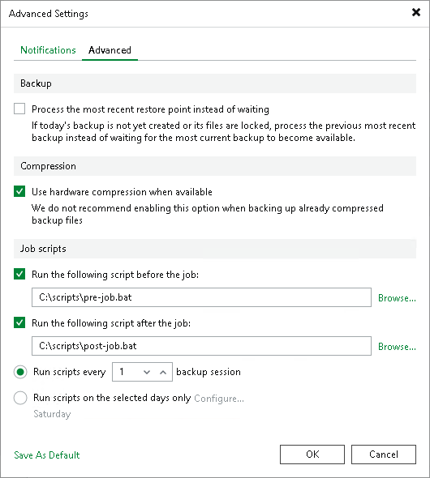

# Advanced Settings for GFS Tape Job

This step of the wizard is available if you selected a GFS media pool at the Media Pool step of the wizard.

1. Sometimes when the tape job starts there is no new daily backup on disk. Select the Process the most recent restore point instead of waiting check box if you want the tape job to copy the latest restore point instead of waiting. If this option is unselected, the tape job will wait for a new restore point.
2. Select the Use hardware compression when available check box if the tape drive should compress data before writing it to tape.
3. Select the Run the following script before the job and Run the following script after the job check boxes and click Browse to choose executable files.

You can select to execute pre- and post-job actions after a number of job sessions or on specific week days.

* If you select the Run scripts every... backup session option, specify the number of the job sessions after which the scripts must be executed.
* If you select the Run scripts on selected days only option, click Days and specify week days on which the scripts must be executed.

|  |
| --- |
| Tip |
| After you specify necessary settings for the tape job, you can save them as default settings. To do this, click Save as Default at the bottom left corner of the Advanced Settings window. When you create a new backup to tape job, Veeam Backup & Replication will automatically apply the default settings to the new job. |

