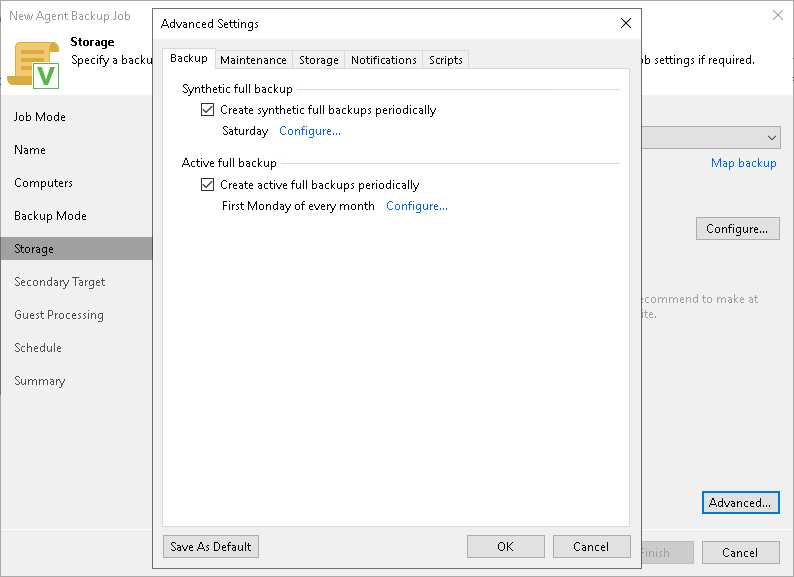

# Backup Settings

To specify settings for a backup chain created with the Veeam Agent backup job managed by the backup server:

1. Click Advanced at the Storage step of the wizard.
2. In the Advanced Settings window, select the Backup tab.
3. If you want to periodically create synthetic full backups, select Create synthetic full backups periodically and click Configure to define the schedule.

|  |
| --- |
| NOTE |
| Synthetic full backup is not available for backup jobs targeted at an object storage repository. |

1. If you want to periodically create active full backups, select Create active full backups periodically and click Configure to define the schedule.

|  |
| --- |
| NOTE |
| Consider the following:   * Before scheduling periodic full backups, you must make sure that you have enough free space on the target location. * If you schedule the active full backup and synthetic full backup on the same day, Veeam Backup & Replication will perform only active full backup. Synthetic full backup will be skipped. |

