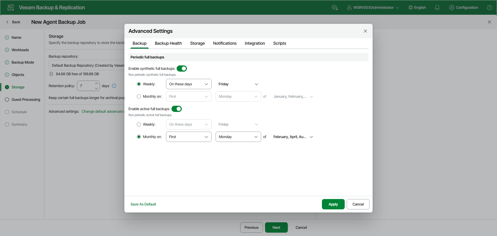

# Backup Settings

To specify settings for a backup chain created with the Veeam Agent backup job managed by the backup server:

1. At the Storage step of the wizard, click Change default advanced settings and open the Backup tab.
2. If you want to periodically create synthetic full backups, under Periodic full backups, turn on the Enable synthetic full backups toggle. Then select Weekly or Monthly on and specify the scheduling settings in the drop-down lists.

|  |
| --- |
| NOTE |
| Synthetic full backup is not available for backup jobs targeted at an object storage repository. |

1. If you want to periodically create active full backups, turn on the Enable active full backups toggle. Then select Weekly or Monthly on and specify the scheduling settings in the drop-down lists.

|  |
| --- |
| NOTE |
| Consider the following:   * Before scheduling periodic full backups, you must make sure that you have enough free space on the target location. * If you schedule the active full backup and synthetic full backup on the same day, Veeam Backup & Replication will perform only active full backup. Synthetic full backup will be skipped. |

Page updated 2026-07-16

