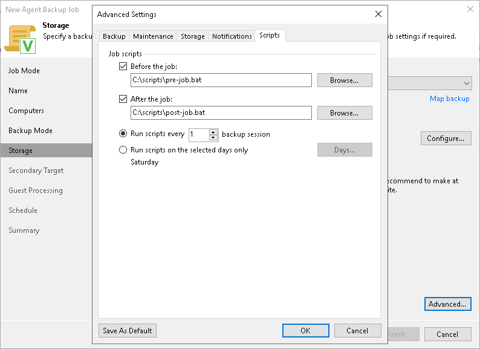

# Script Settings

In this article

You can specify what scripts Veeam Backup & Replication will execute on the backup server before and after the session of the Veeam Agent backup job managed by the backup server.

To specify script settings for the backup job:

1. At the Storage step of the wizard, click Advanced.
2. Click the Scripts tab.
3. If you want to execute custom scripts before and after the backup job, select the Before the job and After the job check boxes and click Browse to choose executable files from a folder on the backup server:

* If you use Veeam Backup & Replication on Linux, select a file from the /var/lib/veeam/scripts\* directory.
* If you use Veeam Backup & Replication on Microsoft Windows, select a file from a local folder.

The scripts are executed on the backup server under the account under which the Veeam Backup Service runs (the local System account or account that has the local Administrator permissions on the backup server).

You can select to execute pre- and post-backup actions after a number of backup sessions or on specific week days.

* If you select the Run scripts every <N> backup session option, specify the number of the backup job sessions after which the scripts must be executed.
* If you select the Run scripts on the selected days only option, click Days and specify week days on which the scripts must be executed.

|  |
| --- |
| TIP |
| Consider the following:   * Custom scripts that you define in the advanced job settings relate to the backup job itself, not the OS quiescence process on protected computers. To add pre-freeze and post-thaw scripts for Veeam Agent computer OS quiescence, use the [Guest Processing](agent_job_guest_scripts.md) step of the wizard. * You can also specify what scripts will be executed on a Veeam Agent computer before and after the backup job session. To learn more, see [Backup Job and Snapshot Scripts](agent_job_guest_scripts.md). |

Page updated 11/4/2025

Page content applies to build 13.0.1.1071
