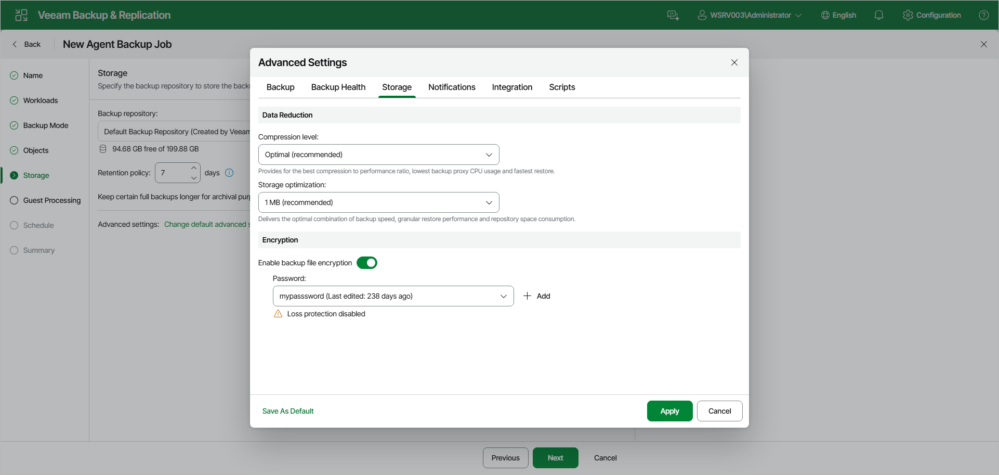

# Storage Settings

To specify storage settings for the Veeam Agent backup job managed by the backup server:

1. At the Storage step of the wizard, click Change default advanced settings and open the Storage tab.
2. Under Data Reduction, from the Compression level drop-down list, select a compression level for the backup: None, Dedupe-friendly, Optimal, High or Extreme. To learn more about the compression levels, see the [Data Compression](https://helpcenter.veeam.com/docs/agentforlinux/userguide/compression_deduplication.html?ver=13) section in the Veeam Agent for Linux User Guide.
3. From the Storage optimization drop-down list, select the size of data blocks: 4 MB, 1 MB, 512 KB, or 256 KB. Veeam Agent for Linux will use data blocks of the chosen size to optimize the size of backup files and job performance.

|  |
| --- |
| NOTE |
| If you change the storage optimization settings for the backup job, new settings will not have any effect on previously created files in the chain. They will be applied to new files created after the settings were changed.  To apply new storage optimization settings in backup jobs, you must create an active full backup after you change storage optimization settings. Veeam Backup & Replication will use the new block size for the active full backup and subsequent backup files in the backup chain. To learn about the active full backup, see [Performing Active Full Backup](agent_job_active_full.md). |

1. To encrypt the content of backup files, under Encryption, turn on the Enable backup file encryption toggle. From the Password drop-down list, select a password that you want to use for encryption. If you have not created the password beforehand, click Add to specify a new password. For more information, see [Password Manager](password_manager.md).

If the backup server is not connected to Veeam Backup Enterprise Manager, you will not be able to restore data from encrypted backups in case you lose the password. Veeam Backup & Replication will display a Loss protection disabled warning under the Password field. For more information, see [Decrypting Data Without Password](decrypt_without_pass.md).

You can select a Key Management System (KMS) server in the Password field. The KMS server must be added to Veeam Backup & Replication in advance. If you choose to use KMS keys for backup file encryption at this step of the wizard, Veeam Backup & Replication immediately starts communication with the KMS server to retrieve the encryption keys. To learn more, see [Key Management System Keys](kms.md).

|  |
| --- |
| NOTE |
| Consider the following:   * If you plan to encrypt the content of backup files, consider the limitations listed in the [Data Encryption Limitations](#encrypt_limits) subsection. * You must encrypt the backup job if you want to back up data to the Veeam Data Vault storage. |

Data Encryption Considerations and Limitations

If you plan to encrypt the content of the backup files, consider the following:

* Data encryption settings for Veeam Agent backup jobs configured in Veeam Backup & Replication are stored in the Veeam Backup & Replication database.
* If you enable encryption for an existing Veeam Agent backup, during the next job session Veeam Agent for Linux will create a full backup file. The created full backup file and subsequent incremental backup files in the backup chain will be encrypted with the specified password.
* Encryption is not retroactive. If you enable encryption for an existing backup job, Veeam Agent for Linux will encrypt the backup chain starting from the next restore point created with this job.

To learn more about data encryption in Veeam Backup & Replication, see [Data Encryption](data_encryption.md).

Page updated 2026-07-16

