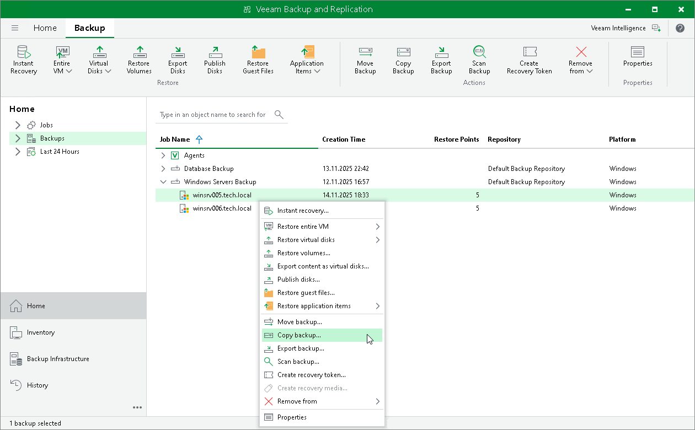
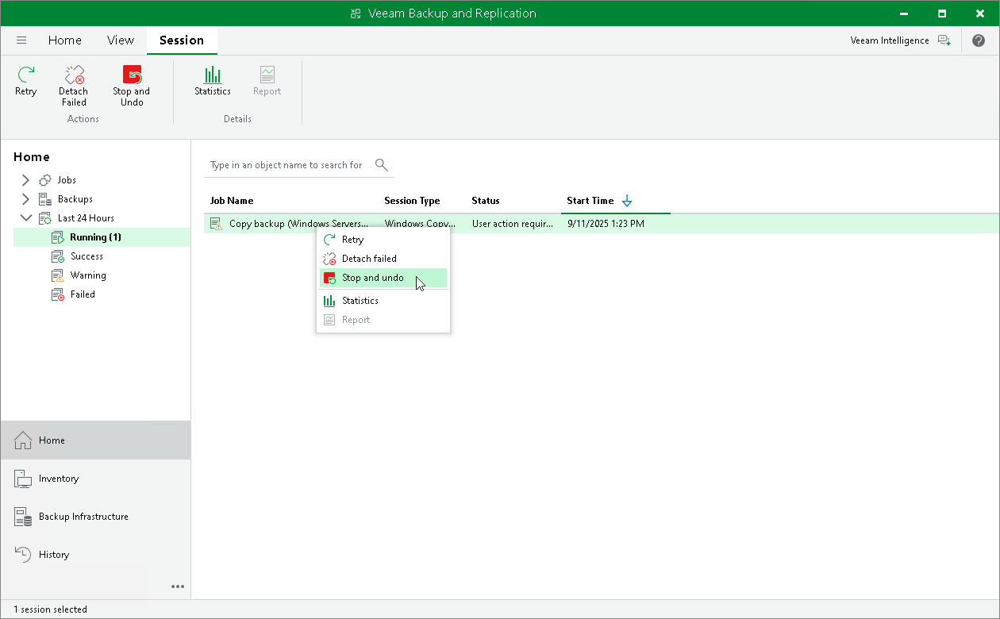

# Copying Backup

In this article

You can copy backups created by a backup job managed by Veeam backup server. This functionality allows you to create several copies of the same backup in different locations, whether onsite or offsite. Backup copies have the same format as files created by backup jobs and you can recover your data from them when you need it.

When Veeam Backup & Replication performs the copy operation, it disables the job, copies files to the target location and then enables the job. To learn more, see [Copying Backups](copy_backup.md).

|  |
| --- |
| NOTE |
| Consider the following:   * You cannot copy backups created by a backup job managed by Veeam Agent (backup policy). To learn about types of Veeam Agent backup jobs, see [Veeam Agent Backup Jobs and Policies](agents_job_mode.md).  * The copy backup feature does not support copying backups between extents of a scale-out backup repository. To learn how to manage backups within the scale-out backup repository, see [Scale-Out Backup Repositories](backup_repository_sobr.md). |

To create a backup copy:

1. Open the Home view.
2. In the inventory pane, click Backups.
3. In the working area, right-click the backup and select Copy backup.
4. In the Copy Backup to Another Location window, choose where you want to copy backups — to a repository or to a local or shared folder.

Managing Failed Activities

If the copy operation fails, Veeam Backup & Replication assigns the User action required status to it. In this case, you need to decide how to finish the operation:

1. Open the Home view.
2. In the inventory pane, select the Last 24 Hours node.
3. Right-click the failed copy session and select the required action or select the required action on the ribbon:

* Retry — to retry the copy operation for failed backups.

During the retry operation, Veeam Backup & Replication does not relaunch the copy operation for the whole backup. Veeam Backup & Replication tries to copy those backup files that were not copied during the move.

* Skip failed — to skip failed backups.
* Stop and undo — to cancel all changes.

|  |
| --- |
| NOTE |
| The original backup job will be in the disabled state until you finalize the failed copy operation. |

Page updated 9/11/2025

Page content applies to build 13.0.1.1071
