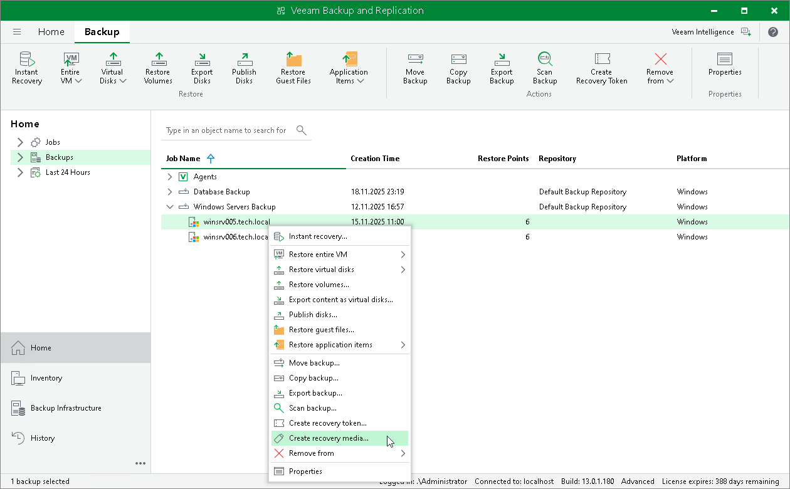

# Creating Veeam Recovery Media from Backup

In this article

You can create the Veeam Recovery Media for a Microsoft Windows computer whose Veeam Agent backup resides on a Veeam backup repository or Veeam Cloud Connect repository. For this operation, you can use a backup created by any type of a Veeam Agent backup job: a backup job managed by the backup server or backup job managed by Veeam Agent (backup policy).

Creating the Veeam Recovery Media for a computer in a backup does not differ from creating the Veeam Recovery Media for a protected computer in the Veeam Backup & Replication inventory. To learn more, see [Creating Veeam Recovery Media](recovery_media_create.md).

To create Veeam Recovery Media:

1. Open the Home view.
2. In the inventory pane, click Backups.
3. In the working area, expand the Veeam Agent backup, select the necessary computer in the backup and click Recovery Media on the ribbon or right-click the computer and select Create recovery media.
4. Complete the steps of the Create Recovery Media wizard.

Page updated 11/14/2025

Page content applies to build 13.0.1.1071
