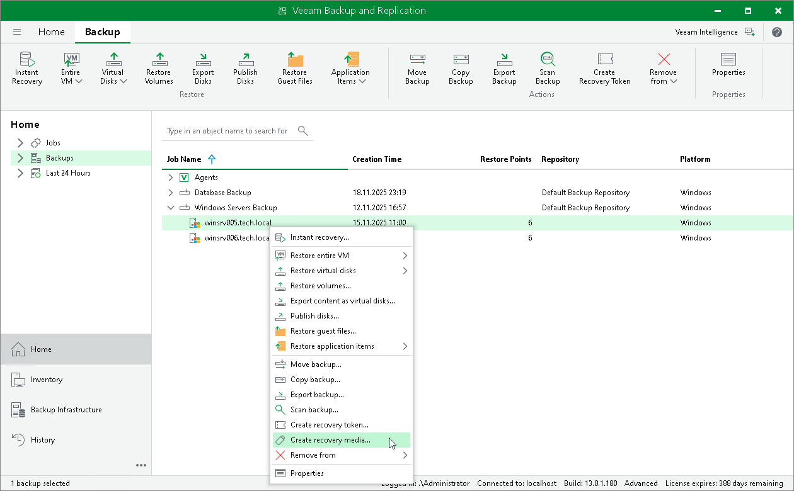

# Creating Veeam Recovery Media from Backup

You can create the Veeam Recovery Media for a Microsoft Windows computer whose Veeam Agent backup resides on a Veeam backup repository or Veeam Cloud Connect repository. For this operation, you can use a backup created by any type of a Veeam Agent backup job: a backup job managed by the backup server or backup job managed by Veeam Agent (backup policy).

To learn more about creating Veeam Recovery Media, see [Creating Veeam Recovery Media](recovery_media_create.md).

You can create Veeam Recovery Media in one of the following ways:

* [Using Veeam Backup & Replication Console](#console)
* [Using Veeam Backup & Replication Web UI](#webui)

Creating Veeam Recovery Media from Backup Using Veeam Backup & Replication Console

To create Veeam Recovery Media in the Veeam Backup & Replication console:

1. Open the Home view.
2. In the inventory pane, click Backups.
3. In the working area, expand the Veeam Agent backup, select the necessary computer in the backup and click Recovery Media on the ribbon or right-click the computer and select Create recovery media.
4. Complete the steps of the Create Recovery Media wizard.

Creating Veeam Recovery Media from Backup Using Veeam Backup & Replication Web UI

To create Veeam Recovery Media in the Veeam Backup & Replication web UI:

1. In the management pane, click Backups.
2. Expand the Veeam Agent backup and select the check box next to the necessary computer.
3. Click Create Recovery Media on the toolbar. Alternatively, right-click the computer and select Create Recovery Media.
4. In the Download Recovery Media Image window, optionally select the Allow remote start from this backup server when this recovery media is booted check box to enable [remote bare metal recovery](integration_instant_restore_media_remote.md) and click OK.

Page updated 2026-07-20

