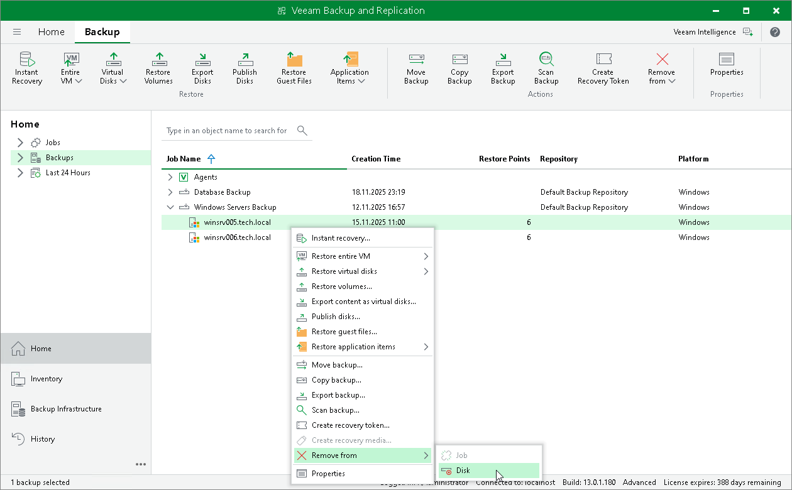

# Removing Backup from Disk

In this article

If you want to delete records about backups from the Veeam Backup & Replication console and configuration database and, additionally, delete backup files from the backup repository, you can use the Remove from disk operation.

|  |
| --- |
| NOTE |
| * You can use the Veeam Backup & Replication console to remove backups created by Veeam Agent backup jobs on the Veeam backup repository or Veeam Cloud Connect repository. Backups created on a local drive of a protected computer or in a network shared folder are not displayed in the Veeam Backup & Replication console. * If you delete a backup of a failover cluster node, backup of all nodes of this cluster will be deleted. |

You can remove an entire backup related to a Veeam Agent backup job or remove specific child backups — backups related to individual computers in the backup.

To remove a Veeam Agent backup from the backup repository:

1. Open the Home view.
2. In the inventory pane, click Backups.
3. In the working area select and remove the necessary backup:

* To remove the entire backup related to the Veeam Agent backup job or policy, select the backup and click Remove from > Disk on the ribbon or right-click the backup and select Remove from > Disk.
* To remove a backup of a specific computer in the Veeam Agent backup job or policy, expand the parent backup, select the necessary computer and click Remove from > Disk on the ribbon or right-click the computer and select Remove from > Disk.

Page updated 11/14/2025

Page content applies to build 13.0.1.1071
