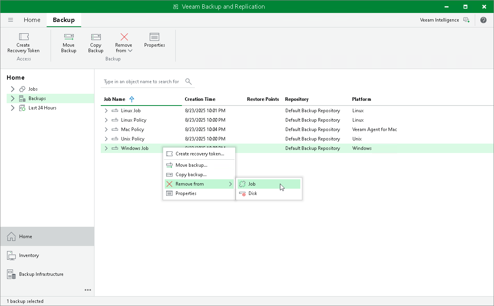

# Detaching Backup from Job

In this article

If you want a backup job to stop processing backup files, you can use the Detach from job operation.

When you detach backups from a job, the backup job will create an active full backup during the next run. This active full backup will reset the backup chain. All incremental backup files will use this active full backup file as a new starting point. A previously used full backup file and its subsequent incremental backup files will remain in the backup repository and also in the Veeam Backup & Replication console. Veeam Backup & Replication shows the detached backups in the Backups > Disk (Orphaned) node of the Home view. Veeam Backup & Replication manages such backups depending on the short-term retention that was set for the backup job:

* If the detached backups belonged to the job with retention period set in days, the background retention process retains the backups according to the configured retention and deletes the backups from the repository after the retention period ends. To learn more, see [Background Retention](background_retention_job.md).
* If the detached backups belonged to the job with retention period set in restore points, the background retention process does not delete the backups. If you do not need the backups, you must delete them manually. To learn more about how to delete backups manually, see [Removing Backup from Disk](agent_backup_delete.md).

Before detaching backups, consider the following:

* Before detaching backups from a backup job, you must disable this backup job and all depending secondary backup jobs.

* You cannot detach backups of individual objects included in a backup job. You can only detach all backups of a backup job.

To detach backups from a job:

1. Open the Home view.
2. In the inventory pane, select the Backups node.
3. In the working area, click Remove from > Job on the ribbon or right-click the necessary backup and select Remove from > Job.

Page updated 11/14/2025

Page content applies to build 13.0.1.1071
