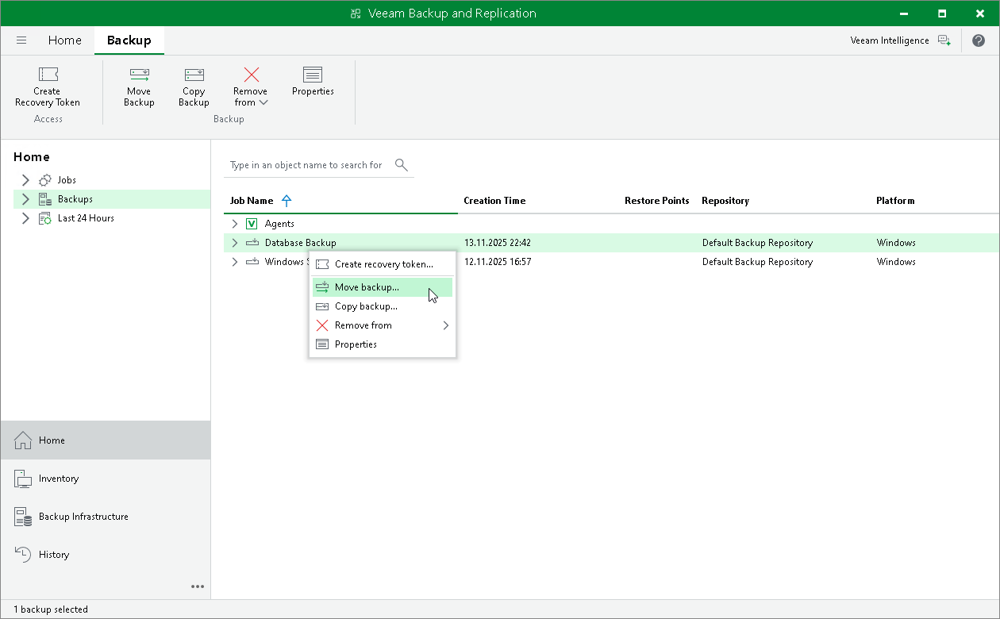
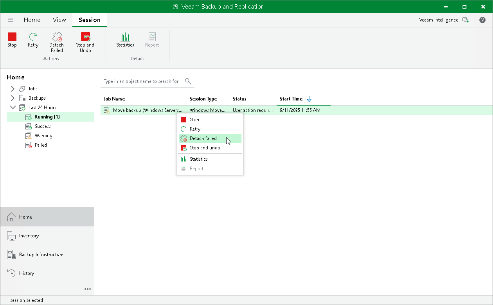

# Moving Backup

In this article

You can move backups created with Veeam Agent in the following ways:

* [Move Veeam Agent backup from one backup job to another](#job).
* [Move Veeam Agent backup from one repository to another](#repository).

|  |
| --- |
| NOTE |
| The move backup feature does not support moving backups between extents of a scale-out backup repository. To learn how to manage backups within the scale-out backup repository, see [Scale-Out Backup Repositories](backup_repository_sobr.md). |

Before You Begin

Before you perform the move operation, consider the following limitations:

* You cannot move backups between Veeam Cloud Connect repositories.

* If you move backups from an immutable repository, the move operation does not delete the backups from the original repository. In this case, backups from the original repository are deleted according to the retention policy. For more information, see [Backup Immutability](agents_object_storage_backup_immutability.md).

* [For Veeam Agent backup policies] You cannot move backups to/from/between object storage repositories.

* [For Veeam Agent backup jobs] You cannot move a backup to another job if the target job already contains a backup of the same Veeam Agent computer or protection group.

* [For Veeam Agent backup jobs] You cannot move an encrypted backup to a job where encryption is not enabled and the other way around.

To learn about how moving to another repository and moving to another job work, see sections [How Moving to Another Repository Works](https://helpcenter.veeam.com/docs/vbr/userguide/backup_moving.html?ver=13#how-moving-to-another-repository-works) and [How Moving to Another Job Works](https://helpcenter.veeam.com/docs/vbr/userguide/backup_moving.html?ver=13#how-moving-to-another-job-works).

For the full list of limitations, see [Requirements and Limitations](https://helpcenter.veeam.com/docs/vbr/userguide/backup_moving.html?ver=13#requirements-and-limitations).

Moving Backup to Another Job

|  |
| --- |
| NOTE |
| You cannot move to another job backups created by a backup job managed by Veeam Agent (backup policy). |

To move a backup to another Veeam Agent backup job:

1. Open the Home view.
2. In the inventory pane, click Backups.
3. In the working area, expand the backup whose files you want to move, right-click the backup and select Move backup or click Move backup on the ribbon.
4. In the Move Backup to Another Job window, select the target backup job to which you want to move your backup.

Keep in mind that Veeam Backup & Replication displays only those backup jobs in the list that have the same backup mode and backed-up computer type as the original backup job. For example, if the original job is a backup job managed by Veeam backup server for Windows-based computers, Veeam Backup & Replication will display in the list only backup jobs managed by Veeam backup server for Windows-based computers.

1. Click OK.

As a result of the move operation:

* The backup is moved to the repository specified in the settings of the target backup job.
* In the Veeam Backup & Replication console, all restore points of the backup are displayed in the node of the target backup job.

|  |
| --- |
| NOTE |
| Consider the following:   * When you move a backup to another backup job, Veeam Backup & Replication disables the original backup job only for the period of the move operation. If you do not want the original backup job to create new backups after the move, you must edit the backup job settings or disable the backup job. For more information, see [Managing Veeam Agent Backup Jobs](agent_job_manage_job.md). * If you want to map the target backup job to the moved backup files, you must add the computers protected by the original backup job to the settings of the target backup job. In this case, the target backup job will continue the backup chain for the moved backups after the start. For more information, see [Adding Protection Groups and Computers from Inventory](agent_job_scope.md#group). |

Moving Backup to Another Repository

To move a backup to another repository, do the following:

1. Open the Home view.
2. In the inventory pane, select the Backups node.
3. In the working area, select the necessary backup job or backup policy.
4. Right-click the job or the policy and select Move backup. Alternatively, click Move Backup on the ribbon.
5. In the Move Backup to Another Location window, select the repository to which you want to move backups.
6. Click OK.

|  |
| --- |
| TIP |
| You can also change the repository in backup job or backup policy settings. After you change the repository, Veeam Backup & Replication will suggest moving backups from the original repository to a new repository. You can select to move backups or leave them in the original repository.  To learn how to edit backup job and backup policy settings, see [Editing Veeam Agent Backup Job Settings](agent_job_edit.md) and [Editing Backup Policy Settings](agent_policy_edit.md). |

Managing Failed Activities

If the move operation fails, Veeam Backup & Replication assigns the User action required status to it. In this case, you need to decide how to finish the operation:

1. Open the Home view.
2. In the inventory pane, select the Last 24 Hours node.
3. Right-click the failed move session and select the required action or select the required action on the ribbon:

* Retry — to retry the move operation for failed backups.

During the retry operation, Veeam Backup & Replication does not relaunch the move operation for the whole backup. Veeam Backup & Replication tries to copy or delete those backup files that were not copied or deleted during the move.

* Detach failed — to detach failed backups.

The detached backups will be shown under the Backups > Orphaned node in the inventory pane.

|  |
| --- |
| NOTE |
| The Detached failed operation is not available for Veeam Agent backup policies. |

* Stop and undo — to cancel all changes.

|  |
| --- |
| NOTE |
| The original backup job will be in the disabled state until you finalize the failed move operation. |

Page updated 11/4/2025

Page content applies to build 13.0.1.1071
