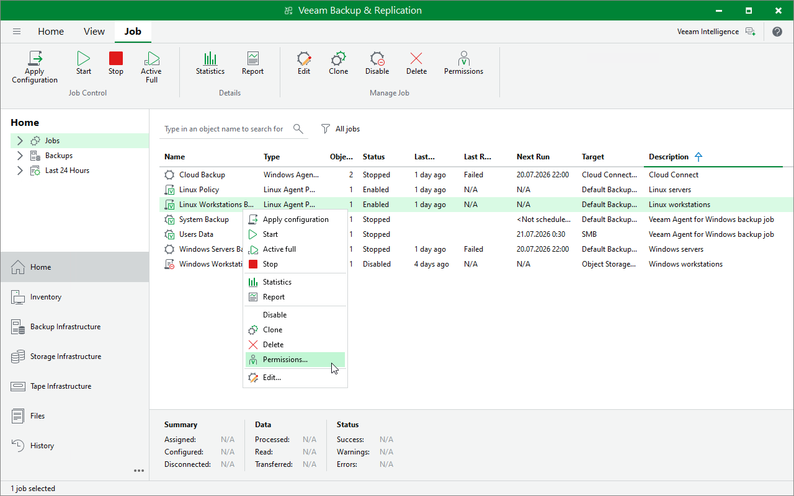
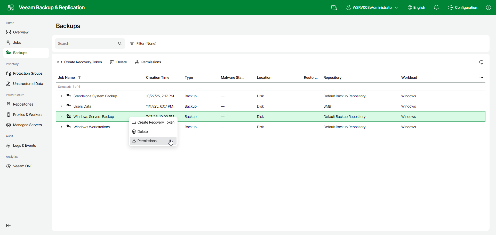

# Viewing Backup Permissions

On the Permissions tab, you can view who owns a Veeam Agent backup job or policy and who can access it.

A backup inherits the Job Owner and Effective Access settings from the backup job or policy that created it. While that job or policy exists, you cannot edit these settings on the backup Permissions tab. To change them, use the [Permissions tab](job_details_permissions_web.md) of the backup job or policy.

If you delete the job or policy, the backup remains and you can edit the Job Owner and Effective Access settings on the backup Permissions tab.

You can view backup permissions in one of the following ways:

* [Using Veeam Backup & Replication Console](#console)
* [Using Veeam Backup & Replication Web UI](#webui)

Viewing Backup Permissions Using Veeam Backup & Replication Console

To view backup permissions in the Veeam Backup & Replication console:

1. Open the Home view.
2. In the inventory pane, click Backups.
3. In the working area, select the backup and click Permissions on the ribbon or right-click the backup and select Permissions.

Viewing Backup Permissions Using Veeam Backup & Replication Web UI

To view backup permissions in the Veeam Backup & Replication web UI:

1. In the management pane, select the Backups node.
2. Select the backup, and click Permissions.

Page updated 2026-07-31

