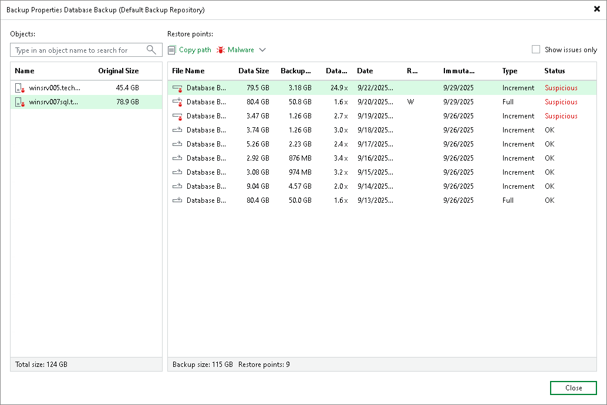
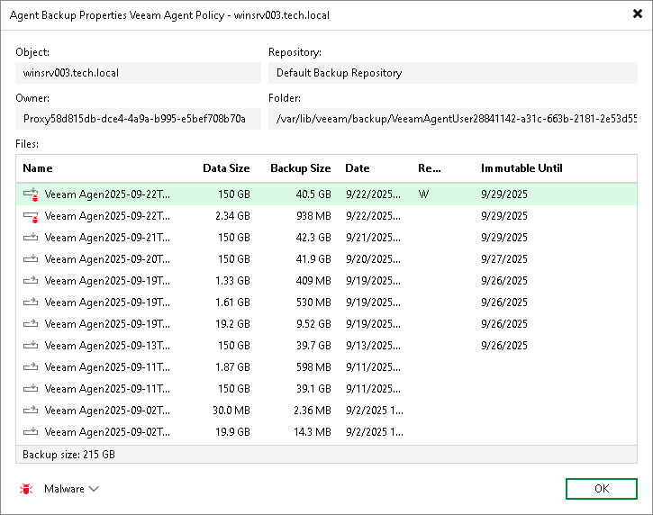

# Viewing Backup Properties

You can view summary information for the [entire backup](#parent) related to a Veeam Agent backup job or [backup of specific objects](#child).

Viewing Information for Entire Backup

To view summary information for the entire backup:

1. Open the Home view.
2. In the inventory pane, select Backups.
3. In the working area, select the backup and click Properties on the ribbon or right-click the backup and select Properties.
4. To see the list of available restore points, select the required object from the Objects list.

In this case, the summary information provides the following data:

* Names of protected objects.

* Size of data on protected objects.
* Malware status of restore points.
* Names and types of backup files.

* Size of backed-up data.
* Backup size.
* Data reduction ratio.

* Dates of restore points creation.

* GFS retention policy applied (W — weekly; M — monthly; Y — yearly).
* Immutability expiration date.

* Types of restore points.

* Dates of backup files creation.

Viewing Information for Specific Object

To view summary information for a backup of a specific object:

1. Open the Home view.
2. In the inventory pane, select Backups.
3. In the working area, expand the backup, select the necessary object and click Properties on the ribbon or right-click the object and select Properties.

In this case, the summary information provides the following data:

* Name of the protected object.
* ID of the internal Veeam Backup & Replication user that has access to the backup files.
* Name of the repository where the backup is stored.
* Path to the folder where the backup is stored.

* Malware status of restore points.

* Names and types of backup files.
* Size of backed-up data.
* Backup size.
* Dates of backup files creation.

* GFS retention policy applied (W — weekly; M — monthly; Y — yearly).
* Immutability expiration date.

