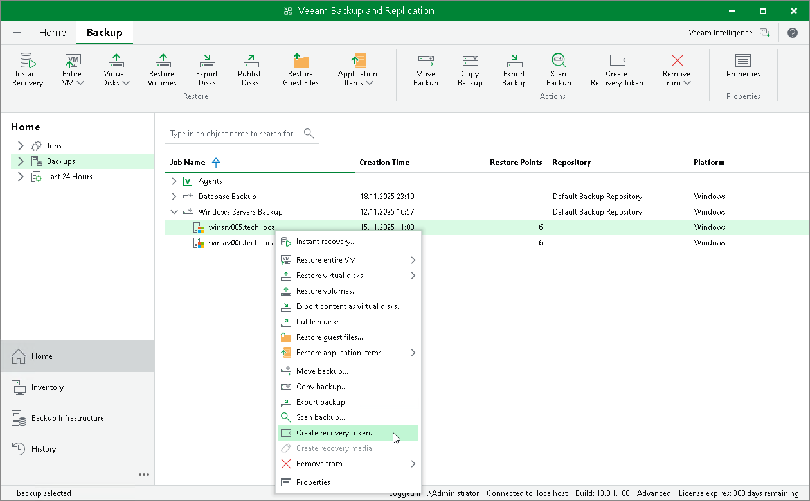

# Creating Recovery Token

If you want to recover files, volumes or an entire computer from a specific backup, you can use the Create recovery token operation.

You can generate the recovery token on the Veeam Backup & Replication side. Then, on the computer side, with this recovery token get access to the backup and recover data that is stored in the backup. To learn more, see one of the following sections depending on Veeam Agent you work with:

* [Veeam Agent for Microsoft Windows](https://helpcenter.veeam.com/docs/agentforwindows/userguide/baremetal_vbr.html?ver=13)
* [Veeam Agent for Linux](https://helpcenter.veeam.com/docs/agentforlinux/userguide/baremetal_volume_restore_vbr.html?ver=13)

* [Veeam Agent for Oracle Solaris](https://helpcenter.veeam.com/docs/agentforsolaris/userguide/baremetal_files_restore_vbr_wiz.html?ver=13)
* [Veeam Agent for IBM AIX](https://helpcenter.veeam.com/docs/agentforaix/userguide/baremetal_files_restore_vbr_wiz.html?ver=13)

* [Veeam Agent for Mac](https://helpcenter.veeam.com/docs/agentformac/userguide/backup_import_vbr_panel.html?ver=13)

Considerations and Limitations

Before creating a recovery token, consider the following prerequisites and limitations:

* Recovery tokens stay valid for 24 hours.
* You can recover data only from the backup for that the recovery token is generated.
* During recovery, Veeam Backup & Replication does not stop backup operations.
* You cannot create a recovery token for backups stored in Veeam Cloud Connect repository.
* You cannot create a recovery token for a whole backup copy job, but you can create a recovery token for individual objects included in a backup copy job.
* If you work with scale-out backup repositories (SOBR), you cannot create a recovery token for backups displayed in Capacity and Archive nodes in the inventory pane. To create a recovery token for such backups, select the backup in the Backups node in the inventory pane.

Generating Recovery Token

To create a recovery token on the Veeam Backup & Replication side:

1. Open the Home view and do the following:

* To create a recovery token for all backups, in the inventory pane, right-click Backups and select Create recovery token.
* To create a recovery token for one backup, in the working area, right-click the necessary backup and select Create recovery token.
* To create a recovery token for several backups, press and hold the [Ctrl] key, select multiple backups, right-click one of the selected backups and select Create recovery token.

1. In the Create Recovery Token window, click Create.

You can also create and modify the existing recovery token using the PowerShell console. To learn more, see the [Working with Tokens](https://helpcenter.veeam.com/docs/vbr/powershell/tokens.html?ver=13) section in the Veeam PowerShell Reference.

|  |
| --- |
| Tip |
| Alternatively, you can get access to the backup using user credentials. To learn more, see one of the following sections depending on Veeam Agent you work with:   * [Veeam Agent for Microsoft Windows](https://helpcenter.veeam.com/docs/agentforwindows/userguide/baremetal_vbr.html?ver=13) * [Veeam Agent for Linux](https://helpcenter.veeam.com/docs/agentforlinux/userguide/baremetal_volume_restore_vbr.html?ver=13)  * [Veeam Agent for Oracle Solaris](https://helpcenter.veeam.com/docs/agentforsolaris/userguide/baremetal_files_restore_vbr_wiz.html?ver=13) * [Veeam Agent for IBM AIX](https://helpcenter.veeam.com/docs/agentforaix/userguide/baremetal_files_restore_vbr_wiz.html?ver=13)  * [Veeam Agent for Mac](https://helpcenter.veeam.com/docs/agentformac/userguide/backup_import_vbr_panel.html?ver=13) |

