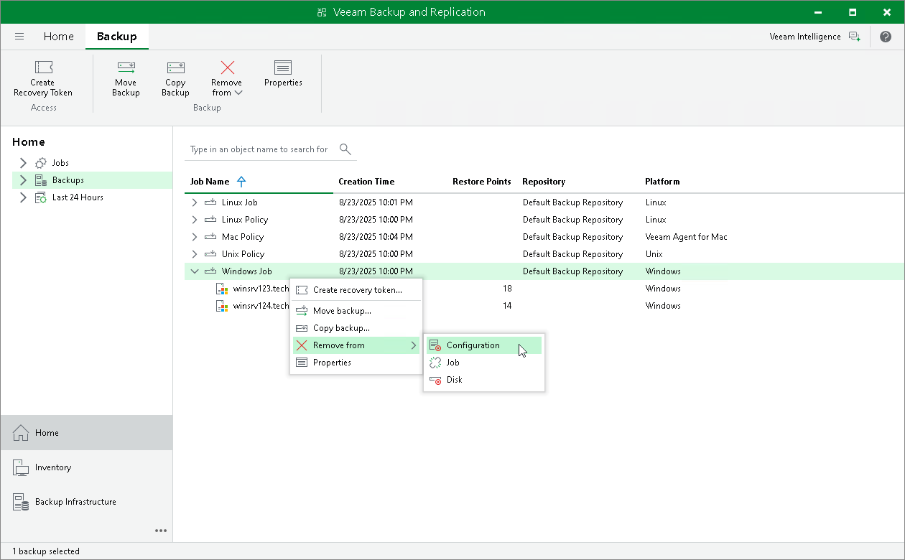

# Removing Backup from Configuration

In this article

If you want to remove records about Veeam Agent backups from the Veeam Backup & Replication console and configuration database, you can use the Remove from configuration operation. When you remove a Veeam Agent backup from configuration, the actual backup files remain on the backup repository. You can import the backup to the Veeam Backup & Replication at any time later and restore data from it.

|  |
| --- |
| IMPORTANT |
| Removing backups from configuration is designed for experienced users only. Consider using the [Detach from job](agent_backup_detach.md) or [Delete from disk](agent_backup_delete.md) operations instead.  Create encrypted configuration backup before removing backups from configuration. To learn more, see [Creating Encrypted Configuration Backups](config_backup_encrypted.md). |

You can remove an entire backup related to a Veeam Agent backup job or remove specific child backups — backups related to individual computers in the backup.

|  |
| --- |
| NOTE |
| Consider the following:   * You can remove backups created by Veeam Agent backup jobs stored in the Veeam backup repository or Veeam Cloud Connect repository. Backups created on a local drive of a protected computer or in a network shared folder are not displayed in the Veeam backup console.  * If you remove from configuration a backup of a failover cluster node, backup of all nodes of this failover cluster will be removed. |

To remove a Veeam Agent backup from configuration:

1. Open the Home view.
2. In the inventory pane, click Backups.
3. In the working area select and remove the necessary backup:

* To remove the entire backup related to the Veeam Agent backup job or policy, select the backup, press and hold the [Ctrl] key, right-click the backup and select Remove from > Configuration.
* To remove a backup of a specific computer in the Veeam Agent backup job or policy, expand the parent backup, select the necessary computer, press and hold the [Ctrl] key, right-click the computer and select Remove from > Configuration.

Page updated 11/14/2025

Page content applies to build 13.0.1.1071
