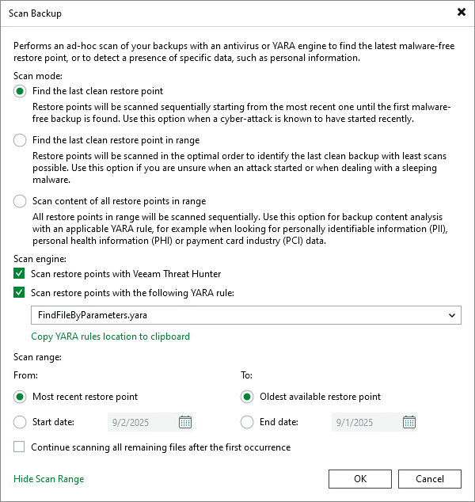

# Scanning Veeam Agent Backups

In this article

You can scan restore points of a backup created by Veeam Agent for Microsoft Windows or Veeam Agent for Linux after a malware attack or to look for some sensitive data in a backup.

You cannot scan backups created by Veeam Agent for IBM AIX, Veeam Agent for Oracle Solaris or Veeam Agent for Mac.

To run the scan backup session:

1. Open the Home view.
2. In the inventory pane, click Backups.
3. In the working area, expand the Veeam Agent backup, select the necessary computer in the backup and click Scan Backup on the ribbon or right-click the computer and select Scan Backup.
4. Specify the scan mode you want to use:

* Find the last clean restore point
* Find the last clean restore point in range
* Scan content of all restore points in range

1. If you want to scan the restored volume with a scan engine or antivirus software, select the method you want to use for data scan:

* Select the Scan restore points with Veeam Threat Hunter option to use Veeam Threat Hunter.

This option is available if you configured Veeam Threat Hunter as the detection engine in the malware detection settings. To learn more, see [Signature Detection](malware_detection_signature_detection.md).

* Select the Scan restore points with your existing antivirus software option to use third-party antivirus software.

This option is available if you configured a third-party antivirus as the detection engine in the malware detection settings. To learn more, see [Signature Detection](malware_detection_signature_detection.md).

|  |
| --- |
| Tip |
| Click Change to open the Malware Detection Settings window where you can change the detection engine to Veeam Threat Hunter. |

1. If you want to use a YARA rule as a scan engine, select the Scan restore points with the following YARA rule check box and specify the YARA file located in the Veeam Backup & Replication product folder:

* /var/lib/veeam/yara\_rules — if you use Veeam Backup & Replication on Linux.
* C:\Program Files\Veeam\Backup and Replication\Backup\YaraRules — if you use Veeam Backup & Replication on Microsoft Windows.

If you do not want to create a malware detection event for a YARA rule, you can add a SuppressMalwareDetectionNotification tag to the name of the rule. For example:

|  |
| --- |
| rule SearchFileHash : SuppressMalwareDetectionNotification |

In this case, the malware detection event will not be created but the scan backup session will be finished with the Warning status.

1. Click Scan Range to configure the scan range. You can specify the following options:

* Scan all restore points, from most recent restore point to the oldest available restore point.
* Scan restore points created during a specific time period.

Veeam Backup & Replication selects the order in which to scan restore points depending on the selected scan mode:

* In the Find the last clean restore point mode, Veeam Backup & Replication scans restore points from the most recent to the oldest.
* In the Find the last clean restore point in range mode, Veeam Backup & Replication scans restore points in the optimal order.
* In the Scan content of all restore points in range mode, Veeam Backup & Replication scans restore points from the oldest to the most recent.

If you want to continue the scan backup session after the first malware or the first piece of specific information is found, select the Continue scanning all remaining files after the first occurrence check box.

1. Click OK.

To learn more, see [Scan Backup](malware_detection_scan_backup.md).

Page updated 11/12/2025

Page content applies to build 13.0.1.1071
