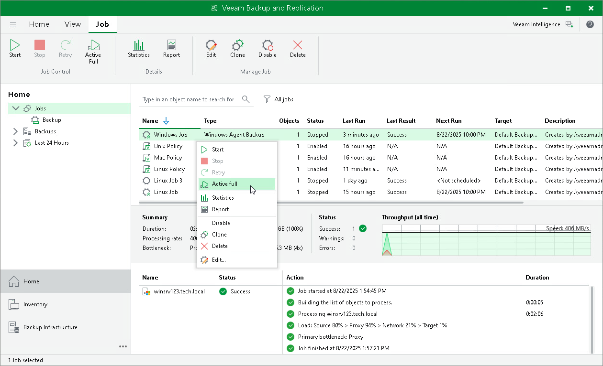
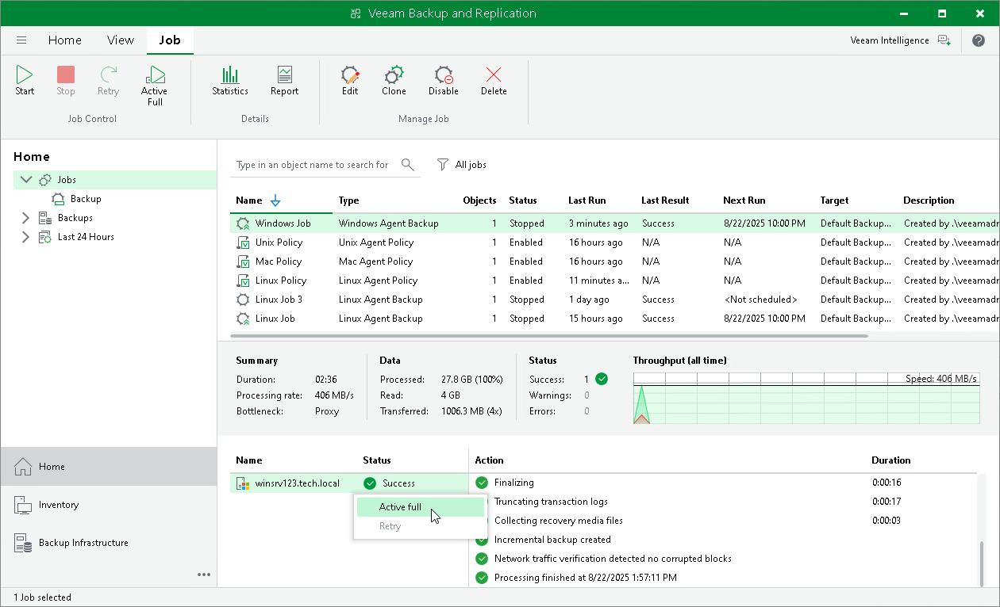
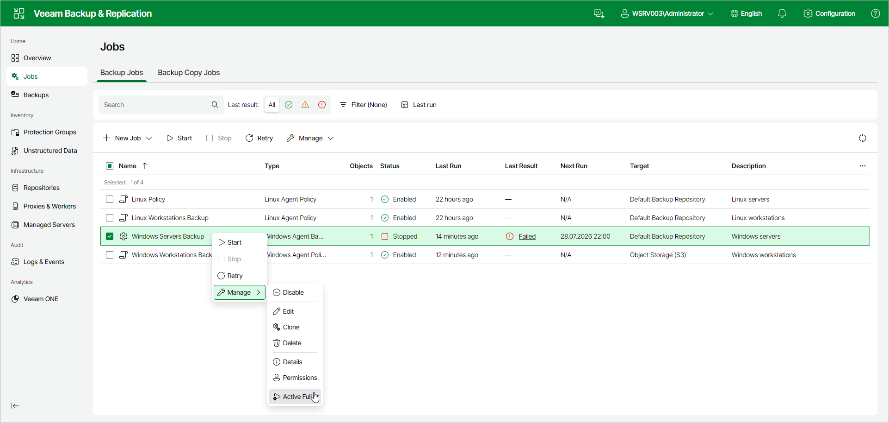

# Performing Active Full Backup

You can create an ad-hoc full backup — active full backup, and add it to the backup chain on the backup repository. The active full backup resets the backup chain. All subsequent incremental backups use the active full backup as a starting point. The previously used full backup will remain on the backup repository until it is removed from the backup chain according to the retention policy.

You can perform an active full backup in one of the following ways:

* [Using Veeam Backup & Replication Console](#console)
* [Using Veeam Backup & Replication Web UI](#webui)

Performing Active Full Backup Using Veeam Backup & Replication Console

To create an active full backup:

1. Open the Home view.
2. In the inventory pane, select Jobs.
3. In the working area, select the Veeam Agent backup job and click Active Full on the ribbon or right-click the job and select Active Full.

|  |
| --- |
| TIP |
| You can also create a full backup of an individual computer added to the backup job. To learn more, see [Performing Active Full Backup for Individual Computer](#individ). |

Performing Active Full Backup for Individual Computer

To create an active full backup for an individual computer:

1. Open the Home view.
2. In the inventory pane, select Jobs.
3. In the working area, select the Veeam Agent backup job.
4. In the bottom part of Veeam Backup & Replication, find the list of computers that are processed by the selected backup job. In the list, right-click the computer and click Active full.

Keep in mind the following:

* You will be able to create an active full backup for another computer in the same job only after active full backup is created for the selected computer.
* You cannot create an active full backup of a failover cluster node.

Performing Active Full Backup Using Veeam Backup & Replication Web UI

|  |
| --- |
| NOTE |
| In the Veeam Backup & Replication web UI, you can create an active full backup only for all computers in a backup job. To create an active full backup for an [individual computer](#individ), use the Veeam Backup & Replication console. |

To create an active full backup:

1. In the management pane, click Jobs.
2. Select the check box next to the necessary backup job, and from the Manage drop-down list, select Active Full. Alternatively, right-click the job and click Manage > Active Full.

Page updated 2026-07-28

