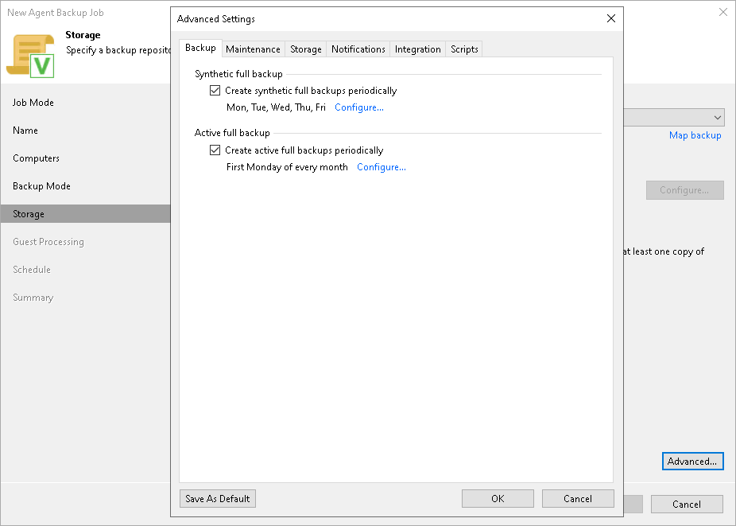

# Backup Settings

In this article

To specify settings for a backup chain created with the backup job:

1. Click Advanced at the Storage step of the wizard.
2. If you want to periodically create synthetic full backups, on the Backup tab, select the Create synthetic full backups periodically check box. Click Configure and use the Monthly on or Weekly options to define scheduling settings.

|  |
| --- |
| NOTE |
| Synthetic full backup is not available for backup jobs targeted at an object storage repository. |

1. If you want to periodically create active full backups, select the Create active full backups periodically check box. Click Configure and use the Monthly on or Weekly options to define scheduling settings.

|  |
| --- |
| NOTE |
| Consider the following:   * Before scheduling periodic full backups, you must make sure that you have enough free space on the target location. For more information about periodic full backups, see the [Active Full Backup](https://helpcenter.veeam.com/docs/agentforwindows/userguide/active_full_backup.html?ver=13) and [Synthetic Full Backup](https://helpcenter.veeam.com/docs/agentforwindows/userguide/synthetic_full_backup.html?ver=13) sections in the Veeam Agent for Microsoft Windows User Guide. * If you schedule the active full backup and synthetic full backup on the same day, Veeam Agent for Microsoft Windows will perform only active full backup. Synthetic full backup will be skipped. |

Page updated 11/4/2025

Page content applies to build 13.0.1.1071
