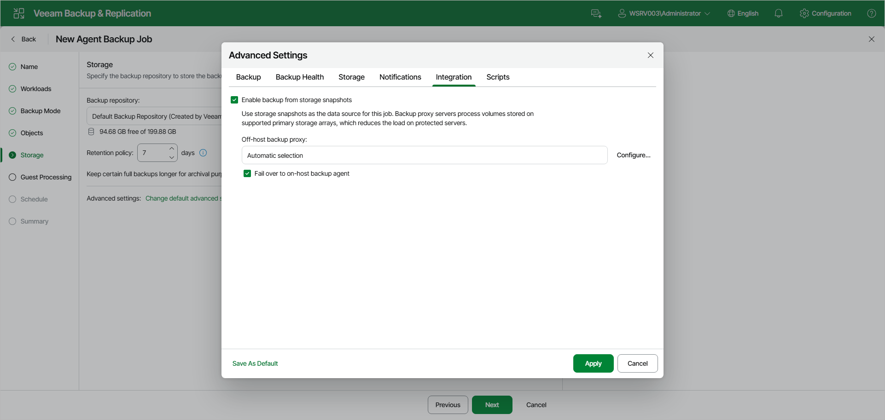
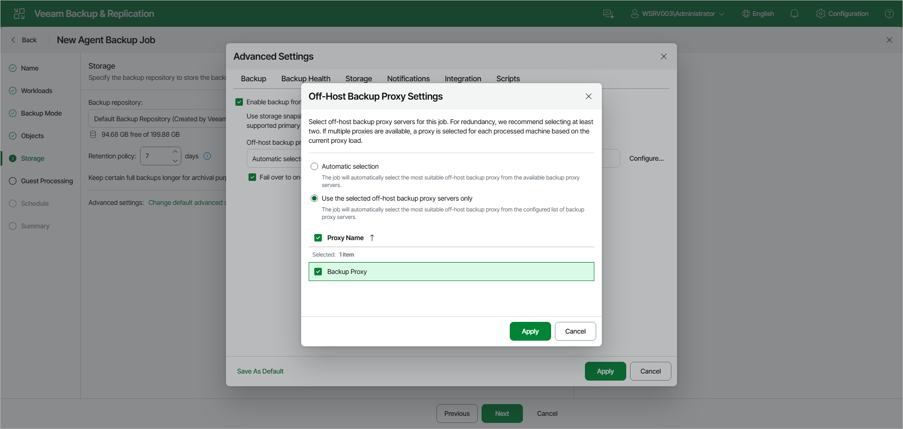

# Integration Settings

You can specify storage integration settings for the job managed by backup server.

Keep in mind that storage integration settings are unavailable if you work with protection group for cloud machines.

To specify storage integration settings for the backup job:

1. At the Storage step of the wizard, click Change default advanced settings and open the Integration tab.
2. If you select the Enable backup from storage snapshots check box, Veeam Backup & Replication will use native storage snapshots to create Veeam Agent backups. To learn more about storage snapshots support, see [Storage Snapshots Support](agents_storage_systems.md).
3. To transfer a snapshot from storage to the target repository, Veeam Backup & Replication uses off-host backup proxies. You can allow Veeam Backup & Replication to use any suitable backup proxies or you can select specific backup proxies. To learn more, see [Selecting Off-Host Backup Proxy](#proxy).
4. If Veeam Backup & Replication fails to create a storage snapshot or backup proxy is unavailable, you can fail over to the regular backup scenario that uses the software VSS provider. To do this, select the Fail over to on-host backup agent check box.

To learn more about regular backup scenario, see the [How Backup Works](https://helpcenter.veeam.com/docs/agentforwindows/userguide/backup_hiw.html?ver=13) section in the Veeam Agent for Microsoft Windows User Guide.

Selecting Off-Host Backup Proxy

To specify what backup proxies Veeam Backup & Replication will use during the backup process, click Configure and select one of the following options in the Off-Host Backup Proxy Settings window:

* If you want Veeam Backup & Replication to use any suitable backup proxies, select the Automatic selection option. In this case, the number of backup proxies that Veeam Backup & Replication uses for data transfer depends on the backup scope.

|  |
| --- |
|  IMPORTANT |
| If you use the NetApp Element storage system and you have 4 or more backup proxies set in your Veeam Backup & Replication infrastructure, you cannot use automatic selection. You must manually select up to 3 backup proxies. |

* If you want to select backup proxies manually, select the Use the selected off-host backup proxy servers only option and select check boxes near backup proxies you plan to use.

Keep in mind that Veeam Backup & Replication displays only those backup proxies that run Microsoft Windows Server OS. For more information about backup proxy requirements, see [Storage Snapshots Support](agents_storage_systems.md#limits).

Page updated 2026-07-15

