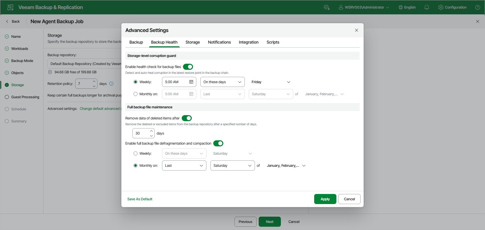

# Backup Health Settings

You can specify backup health settings for a backup chain created with the Veeam Agent backup job. These operations help make sure that the backup chain remains valid and consistent.

To specify backup health settings for the backup job:

1. At the Storage step of the wizard, click Change default advanced settings and open the Backup Health tab.
2. To periodically perform a health check for the latest restore point in the backup chain, under Storage-level corruption guard, turn on the Enable health check for backup files toggle. Then select Weekly or Monthly on and specify the scheduling settings in the drop-down lists.

An automatic health check can help you avoid a situation where a restore point gets corrupted, making all dependent restore points corrupted, too. If during the health check Veeam Agent for Microsoft Windows or Veeam Backup & Replication detect corrupted data blocks in the latest restore point in the backup chain (or the restore point before the latest one if the latest restore point is incomplete), it will start the health check retry and transport valid data blocks from the Veeam Agent computer to the target location. The transported data blocks are stored to a new backup file or the latest backup file in the backup chain, depending on the data corruption scenario.

For Veeam Agent backup jobs managed by the backup server, the health check process is similar to the one for backup jobs that process VMs. For more information, see [Health Check for Backup Files](backup_health_check.md).

1. Under Full backup file maintenance, turn on the Remove data of deleted items after toggle and specify the number of days for which you want to keep the data of items removed from the backup job in the target location.

For backup jobs managed by the backup server, deleted items retention policy is similar to retention policy for deleted VMs. After you remove a protection group or individual computer from a Veeam Agent backup job, Veeam Backup & Replication will keep its data on the backup repository for the period that you have specified. When this period is over, backup data of this computer will be removed from the backup repository. For more information, see [Retention Policy for Deleted Items](retention_deleted_vms.md).

By default, the deleted items data retention period is 30 days. Do not set the deleted items retention period to 1 day or a similar short interval. In the opposite case, the backup job may work not as expected and remove data that you still require.

1. To periodically defragment and compact a full backup, turn on the Enable full backup file defragmentation and compaction toggle. Then select Weekly or Monthly on and specify the scheduling settings in the drop-down lists. During the compact operation, data blocks from the full backup file are copied to a new empty file. As a result, the full backup file gets defragmented, and the speed of reading from and writing to the backup file increases.

|  |
| --- |
| NOTE |
| The Enable full backup file defragmentation and compaction option is not available for backup jobs targeted at object storage. |

For Veeam Agent backup jobs managed by the backup server, the compact operation is similar to the compact operation performed for VM backup jobs. If the full backup file contains data blocks for deleted items (protection groups or individual computers that were removed from the backup job), Veeam Backup & Replication will remove these data blocks. For more information, see [Compact of Full Backup File](backup_compact_file.md).

|  |
| --- |
| NOTE |
| Consider the following:   * If you want to periodically compact a full backup, you must make sure that you have enough free space in the target location. For the compact operation, the amount of free space must be equal to or more that the size of the full backup file. * In contrast to the compact operation for a VM backup, during compact of a full Veeam Agent backup file, Veeam Backup & Replication does not perform the data take out operation. If the full backup file contains data for a computer that has only one restore point and this restore point is older than 7 days, Veeam Backup & Replication will not extract data for this computer to a separate full backup file. |

Page updated 2026-07-15

