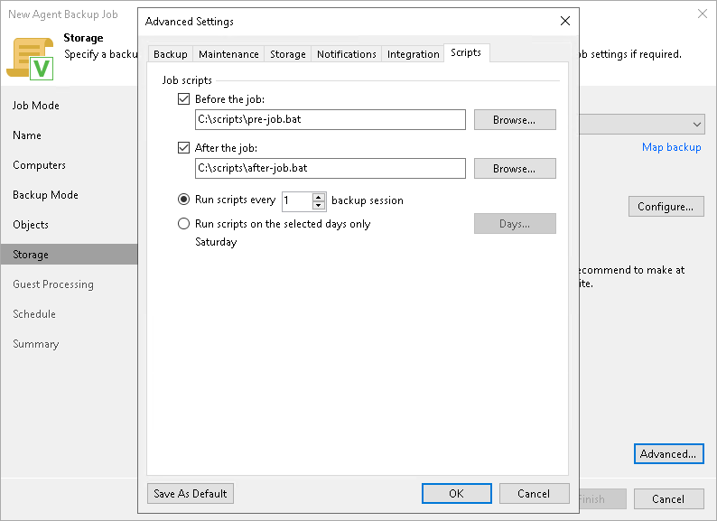

# Script Settings

You can specify script settings for the job managed by backup server.

To specify script settings for the backup job:

1. At the Storage step of the wizard, click Advanced.
2. Click the Scripts tab.
3. If you want to execute custom scripts before or after the backup job, select the Before the job or After the job check boxes and click Browse to choose executable files from a folder on the backup server:

* If you use Veeam Backup & Replication on Linux, select a file from the /var/lib/veeam/scripts\* directory.
* If you use Veeam Backup & Replication on Microsoft Windows, select a file from a local folder.

The scripts are executed on the backup server.

You can select to execute pre- and post-backup actions after a number of backup sessions or on specific week days.

* If you select the Run scripts every <N> backup session option, specify the number of the backup job sessions after which the scripts must be executed:
* If you select the Run scripts on the selected days only option, click Days and specify week days on which the scripts must be executed.

|  |
| --- |
|  NOTE |
| Custom scripts that you define in the advanced job settings relate to the backup job itself, not the OS quiescence process on protected computers. To add pre-freeze and post-thaw scripts for Veeam Agent computer OS quiescence, use the [Guest Processing](agent_job_vss.md) step of the wizard. |

