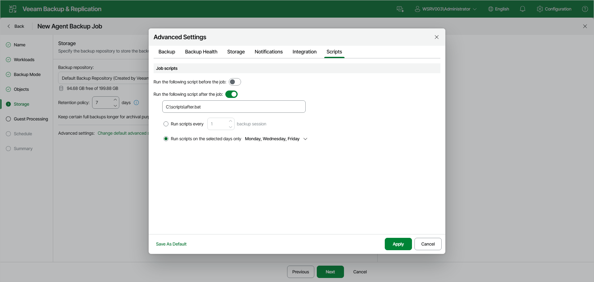

# Script Settings

Before you configure script execution settings, review the considerations and limitations in the [Backup Job and Snapshot Scripts](agents_backup_windows_scripts.md) section.

You can specify script settings for the job managed by backup server.

To specify script settings for the backup job:

1. At the Storage step of the wizard, click Change default advanced settings and open the Scripts tab.
2. Under Job scripts, turn on the Run the following script before the job or Run the following script after the job toggle (or both), and specify the path to the executable file in the field below.

* If you use Veeam Backup & Replication on Linux, specify a path to a file in the /var/lib/veeam/scripts\* directory.
* If you use Veeam Backup & Replication on Microsoft Windows, specify a path to a file in a local folder.

The scripts are executed on the backup server.

You can select to execute pre- and post-backup actions after a number of backup sessions or on specific week days.

* If you select the Run scripts every option, specify the number of backup job sessions after which the scripts must be executed.
* If you select the Run scripts on the selected days only option, expand the drop-down list on the right and select the week days on which the scripts must be executed.

|  |
| --- |
| NOTE |
| Custom scripts that you define in the advanced job settings relate to the backup job itself, not the OS quiescence process on protected computers. To add pre-freeze and post-thaw scripts for Veeam Agent computer OS quiescence, use the [Guest Processing](agent_job_vss_web.md) step of the wizard. |

Page updated 2026-07-15

