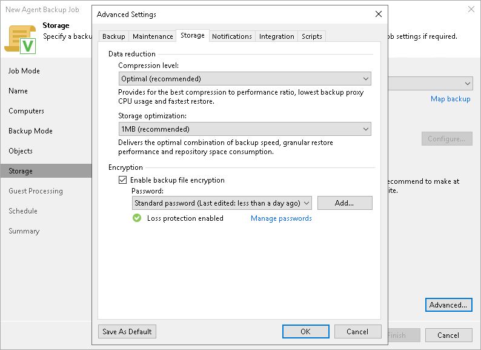

# Storage Settings

To specify storage settings for the backup job:

1. Click Advanced at the Storage step of the wizard.
2. In the Advanced Settings window, select the Storage tab.
3. [For a failover cluster backup job] By default, Veeam Backup & Replication deduplicates failover cluster data before storing it in the backup repository. Data deduplication provides a smaller size of the backup file but may reduce the backup job performance. You can disable data deduplication if necessary, for example, if you use a deduplication storage appliance as a backup repository. To disable data deduplication, clear the Enable inline data deduplication check box.

|  |
| --- |
| NOTE |
| The Enable inline data deduplication option is unavailable if you selected the Server option at the [Job Mode](agent_job_protection_mode.md) step of the wizard. |

1. From the Compression level list, select a compression level for the backup: None, Dedupe-friendly, Optimal, High or Extreme. To learn more about the compression levels, see the [Data Compression](https://helpcenter.veeam.com/docs/agentforwindows/userguide/compression_deduplication.html?ver=13) section in the Veeam Agent for Microsoft Windows User Guide.
2. In the Storage optimization section, select what size of data blocks you plan to use: 4 MB, 1 MB, 512 KB, 256 KB. Veeam Agent for Microsoft Windows will use data blocks of the chosen size to optimize the size of backup files and job performance.

|  |
| --- |
| NOTE |
| If you change the storage optimization settings for the backup job, new settings will not have any effect on previously created files in the chain. They will be applied to new files created after the settings were changed.  To apply new storage optimization settings in backup jobs, you must create an active full backup after you change storage optimization settings. Veeam Backup & Replication will use the new block size for the active full backup and subsequent backup files in the backup chain. To learn about the active full backup, see [Performing Active Full Backup](agent_job_active_full.md). |

1. To encrypt the content of backup files, select the Enable backup file encryption check box. In the Password field, select a password that you want to use for encryption. If you have not created the password beforehand, click Add or use the Manage passwords link to specify a new password. For more information, see [Password Manager](password_manager.md).

If the backup server is not connected to Veeam Backup Enterprise Manager, you will not be able to restore data from encrypted backups in case you lose the password. Veeam Backup & Replication will display a warning about it. For more information, see [Decrypting Data Without Password](decrypt_without_pass.md).

You can select a Key Management System (KMS) server in the Password field. The KMS server must be added to Veeam Backup & Replication in advance. If you choose to use KMS keys for backup file encryption at this step of the wizard, Veeam Backup & Replication immediately starts communication with the KMS server to retrieve the encryption keys. To learn more, see [Key Management System Keys](kms.md).

|  |
| --- |
| NOTE |
| Consider the following:   * If you plan to encrypt the content of backup files, consider the limitations listed in the [Data Encryption Limitations](#encrypt_limits) subsection. * You must encrypt the backup job if you want to back up data to the Veeam Data Vault storage. |

Data Encryption Considerations and Limitations

If you plan to encrypt the content of the backup files, consider the following:

* Data encryption settings for Veeam Agent backup jobs configured in Veeam Backup & Replication are stored in the Veeam Backup & Replication database.

* If you enable or disable encryption for an existing Veeam Agent backup, during the next job session Veeam Agent for Microsoft Windows will create a full backup file. The created full backup file and subsequent incremental backup files in the backup chain will be encrypted with the specified password.

* Encryption is not retroactive. If you enable encryption for an existing backup job, Veeam Backup & Replication will encrypt the backup chain starting from the next restore point created with this job.

To learn more about data encryption in Veeam Backup & Replication, see [Data Encryption](data_encryption.md).

