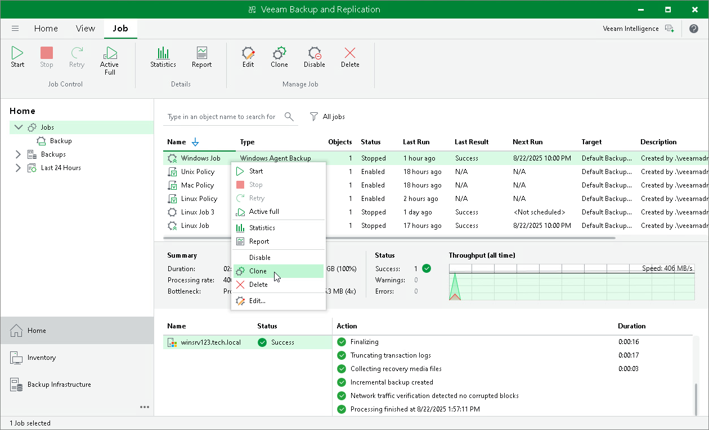
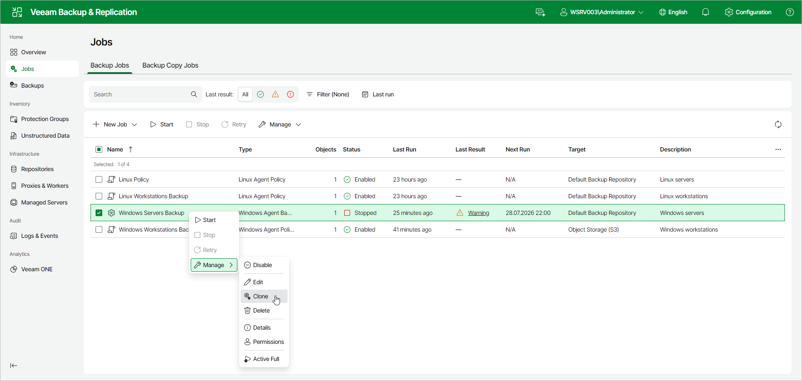

# Cloning Veeam Agent Backup Job

You can clone Veeam Agent backup jobs configured in Veeam Backup & Replication. For example, you may want to configure a Veeam Agent backup job that will be used as a ‘job template’, and use this job to create multiple jobs with similar settings.

You can clone a Veeam Agent backup job in one of the following ways:

* [Using Veeam Backup & Replication Console](#console)
* [Using Veeam Backup & Replication Web UI](#webui)

Cloning Veeam Agent Backup Job Using Veeam Backup & Replication Console

To clone a Veeam Agent backup job:

1. Open the Home view.
2. In the inventory pane, select Jobs.
3. In the working area, select the job and click Clone on the ribbon or right-click the job and select Clone.
4. After a job is cloned, you can edit all its settings, including the job name.

Cloning Veeam Agent Backup Job Using Veeam Backup & Replication Web UI

To clone a Veeam Agent backup job:

1. In the management pane, click Jobs.
2. Select the check box next to the necessary backup job, and from the Manage drop-down list, select Clone. Alternatively, right-click the job and click Manage > Clone.
3. After a job is cloned, you can edit all its settings, including the job name.

Page updated 2026-07-28

