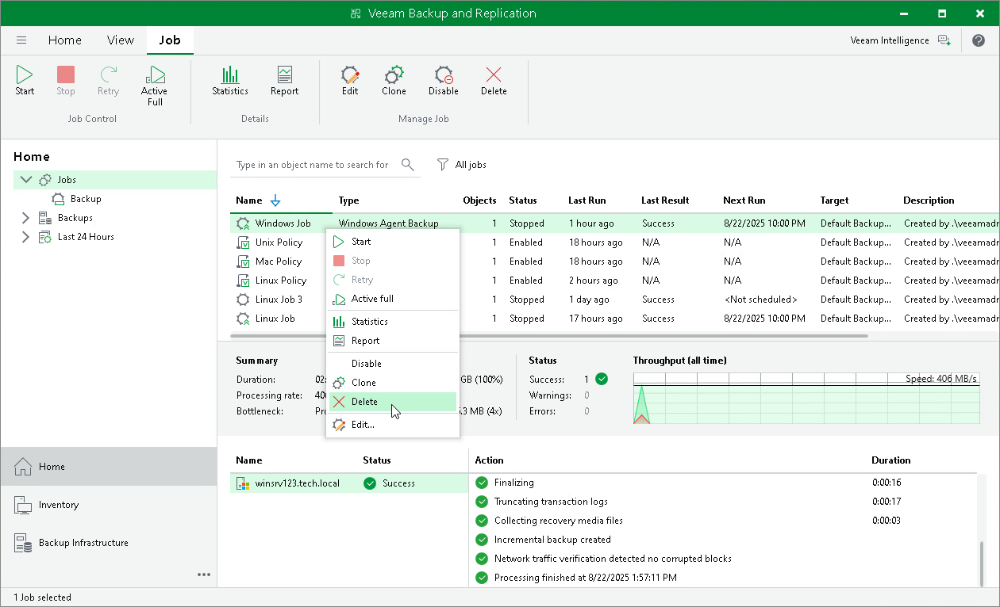

# Removing Veeam Agent Backup Job

You can permanently remove a Veeam Agent backup job from Veeam Backup & Replication. When you remove a job, Veeam Agent backups created by this job remain intact on the backup repository. In the Veeam Backup & Replication console, such backups are displayed in the Home view, under the Backups > Orphaned node in the inventory pane.

When you remove a backup job, Veeam Backup & Replication does not delete Veeam Agent from computers protected by this backup job.

To remove a job:

1. Open the Home view.
2. In the inventory pane, select Jobs.
3. In the working area, select the Veeam Agent backup job and click Delete on the ribbon or right-click the job and select Delete.

