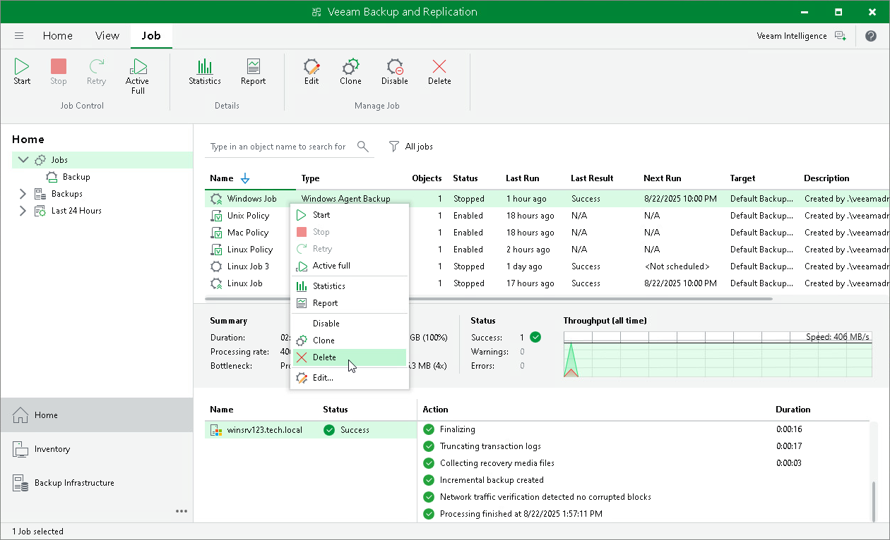
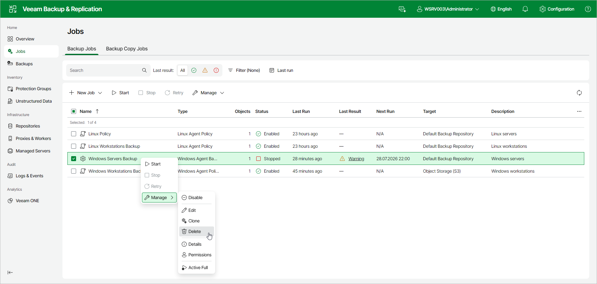

# Removing Veeam Agent Backup Job

You can permanently remove a Veeam Agent backup job from Veeam Backup & Replication. When you remove a job, Veeam Agent backups created by this job remain intact on the backup repository. In the Veeam Backup & Replication console, such backups are displayed in the Home view, under the Backups > Orphaned node in the inventory pane.

When you remove a backup job, Veeam Backup & Replication does not delete Veeam Agent from computers protected by this backup job.

You can remove a Veeam Agent backup job in one of the following ways:

* [Using Veeam Backup & Replication Console](#console)
* [Using Veeam Backup & Replication Web UI](#webui)

Removing Veeam Agent Backup Job Using Veeam Backup & Replication Console

To remove a job:

1. Open the Home view.
2. In the inventory pane, select Jobs.
3. In the working area, select the Veeam Agent backup job and click Delete on the ribbon or right-click the job and select Delete.

Removing Veeam Agent Backup Job Using Veeam Backup & Replication Web UI

To remove a job:

1. In the management pane, click Jobs.
2. Select the check box next to the necessary backup job, and from the Manage drop-down list, select Delete. Alternatively, right-click the job and click Manage > Delete.

Page updated 2026-07-28

