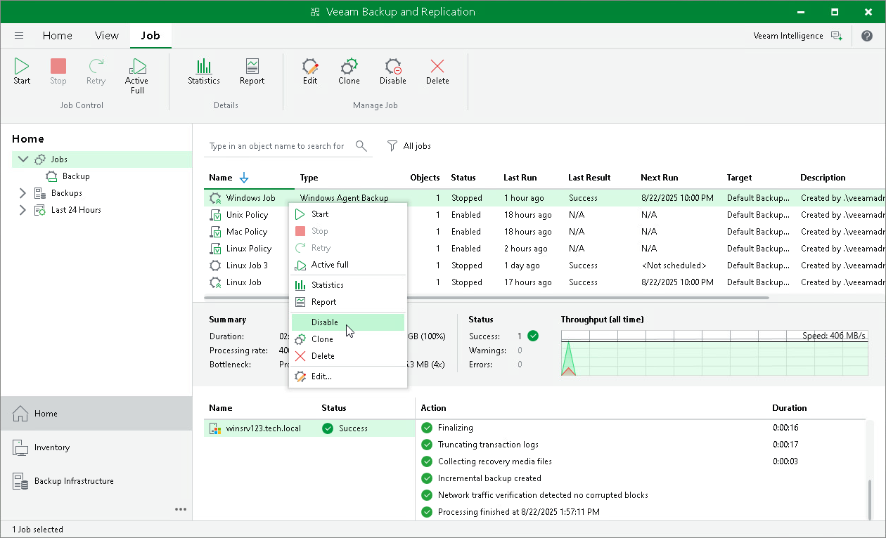

# Enabling and Disabling Veeam Agent Backup Job

In this article

You can temporary disable Veeam Agent backup jobs configured in Veeam Backup & Replication. When you disable a job, Veeam Backup & Replication does not start the job by the specified schedule. You can start a disabled job manually at any time you need. You can also enable a disabled job at any time.

To disable a job:

1. Open the Home view.
2. In the inventory pane, select Jobs.
3. In the working area, select the job and click Disable on the ribbon or right-click the job and select Disable.

To enable a disabled job, select it in the list and click Disable on the ribbon once again.

Page updated 8/22/2025

Page content applies to build 13.0.1.1071
