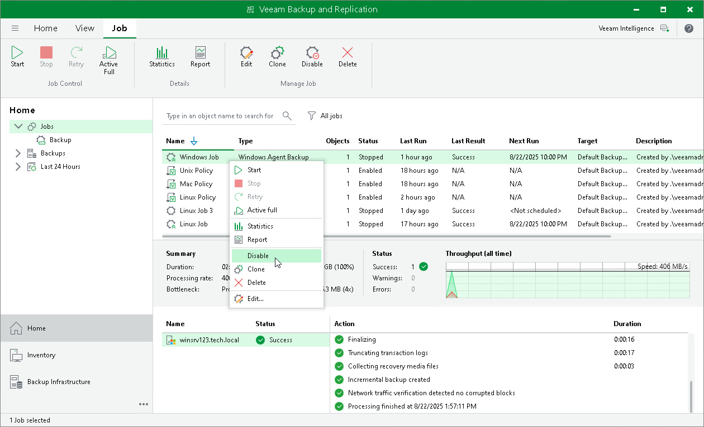
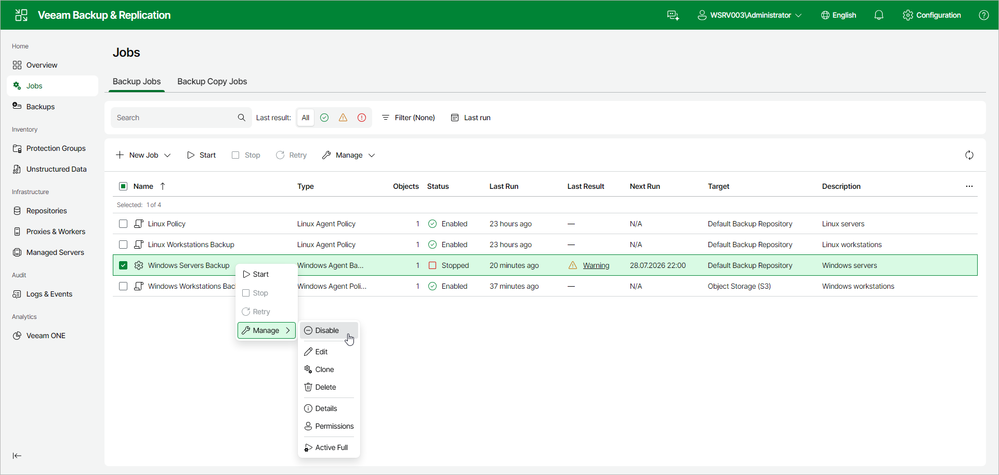

# Enabling and Disabling Veeam Agent Backup Job

You can temporary disable Veeam Agent backup jobs configured in Veeam Backup & Replication. When you disable a job, Veeam Backup & Replication does not start the job by the specified schedule. You can start a disabled job manually at any time you need. You can also enable a disabled job at any time.

You can enable or disable a Veeam Agent backup job in one of the following ways:

* [Using Veeam Backup & Replication Console](#console)
* [Using Veeam Backup & Replication Web UI](#webui)

Enabling and Disabling Veeam Agent Backup Job Using Veeam Backup & Replication Console

To disable a job:

1. Open the Home view.
2. In the inventory pane, select Jobs.
3. In the working area, select the job and click Disable on the ribbon or right-click the job and select Disable.

To enable a disabled job, select it in the list and click Disable on the ribbon once again.

Enabling and Disabling Veeam Agent Backup Job Using Veeam Backup & Replication Web UI

To disable a job:

1. In the management pane, click Jobs.
2. Select the check box next to the necessary backup job, and from the Manage drop-down list, select Disable. Alternatively, right-click the job and click Manage > Disable.

To enable a disabled job, select it and click Manage > Enable on the toolbar, or right-click the job and click Manage > Enable.

Page updated 2026-07-28

