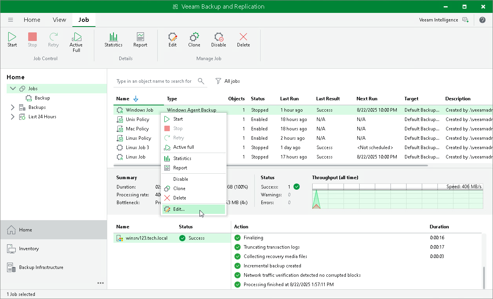

# Editing Veeam Agent Backup Job Settings

You can edit Veeam Agent backup jobs configured in Veeam Backup & Replication at any time. For example, you may want to edit a backup job to change the backup scope, target location or job scheduling settings.

|  |
| --- |
| NOTE |
| Consider the following:   * You cannot change the type of protected computers added to the job and the job mode (that is, change a Veeam Agent backup job to a backup policy and vice versa). * [For Veeam Agent backup jobs for Linux computers] You cannot change the backup mode from file-level to volume-level and vice versa. |

To edit job settings:

1. Open the Home view.
2. In the inventory pane, select Jobs.
3. In the working area, select the job and click Edit on the ribbon or right-click the job and select Edit.
4. Complete the steps of the Edit Agent Backup Job wizard to change the job settings as required.

