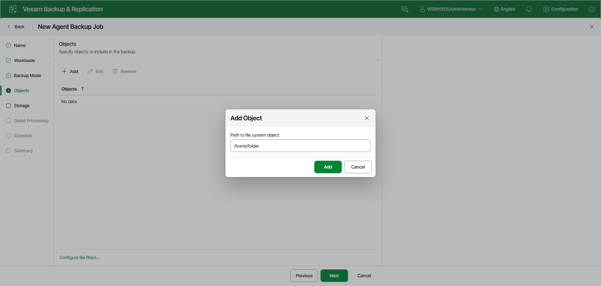
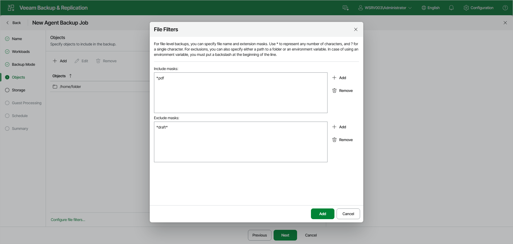

# Specifying Directories to Back Up

The Objects step of the wizard is available if you have selected the File-level backup option at the [Backup Mode](agent_job_mode_linux_web.md) step of the wizard.

At this step of the wizard, you must specify the backup scope by defining what directories with files you want to include in the backup. The specified backup scope settings will apply to all computers that are added to the backup job. If a specified directory does not exist on one or more computers in the job, the job will skip such folder on those computers and back up existing ones.

To specify directories to back up:

1. On the toolbar, click Add.
2. In the Add Object window, in the Path to file system object field, type the path to a directory that you want to back up, for example, /home/user01, and click Add.

|  |
| --- |
| IMPORTANT |
| Consider the following about adding objects to the backup scope:   * If you specify only the root directory (/), Veeam Agent will not automatically include the nested mount points in the backup scope.   To back up all nested mount points, including network file systems such as mounted NFS or SMB network shared folders, you must specify each mount point individually (for example: /, /home, /var, and so on). For example, to back up a network shared folder mounted to /home/media, adding / or /home to the backup scope will not be sufficient — you must specify the /home/media directory.   * Veeam Agent does not support backup of bind mount points. You must specify the path to the original mount point instead. |

1. Repeat steps 1–2 for all directories that you want to back up.

You can also modify the list of objects in the following ways:

* To edit an object, select it and click Edit on the toolbar.
* To remove an object from the list, select it and click Remove on the toolbar.

Configuring Filters

To include or exclude files of a specific type in/from the file-level backup, you can configure filters.

To configure a filter:

1. At the Objects step of the wizard, click Configure file filters.
2. Specify what files you want to back up:

* In the Include masks field, you can specify names and masks for files or file types you want to back up — for example, Report.pdf or \*filename\*. Veeam Agent will back up only the files or file types specified in the include masks. Other files in the backup scope will not be backed up.
* In the Exclude masks field, you can specify paths to directories, as well as names and masks for files or file types, you do not want to back up — for example, /home/user01, OldReports.tar.gz or \*.odt. Veeam Agent will back up all files in the backup scope except files that match the criteria defined in the exclude masks.

|  |
| --- |
| NOTE |
| Consider the following when excluding directories:   * Before you specify a directory to exclude, you must first include a higher-level parent directory in the backup scope. For example, if you want to back up all files on the computer except the /home/user01/archive\_reports directory, you must include the root directory (/) and specify /home/user01/archive\_reports in the exclude masks. * You must specify the full path to each directory you want to exclude. Wildcard characters are not supported in directory paths. |

1. Click Add.
2. Repeat steps 2–3 for each mask that you want to add.

You can use a combination of include and exclude masks. Note that exclude masks have a higher priority than include masks. For example, you can specify masks in the following way:

* Include mask: \*.pdf
* Exclude mask: \*draft\*

Veeam Agent for Linux will include in the backup all files of the PDF format that do not contain draft in their names.

Page updated 2026-07-16

