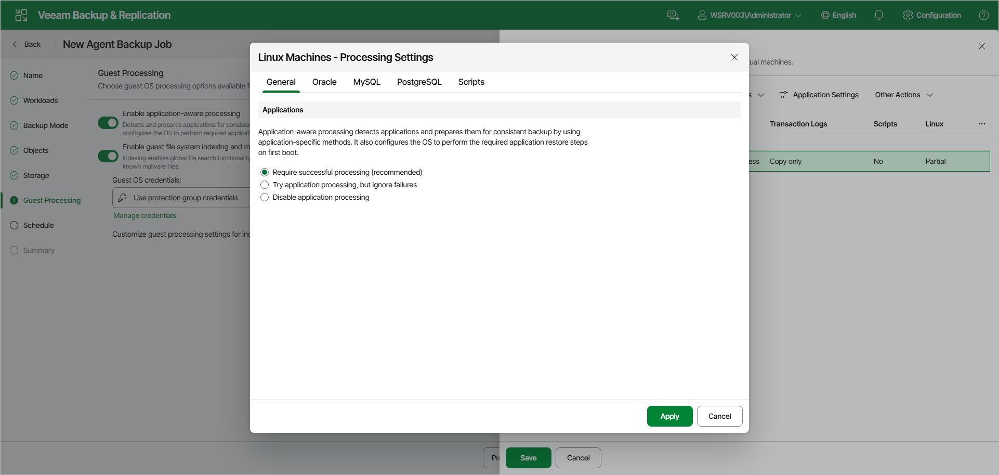

# Application-Aware Processing

If a computer protected with Veeam Agent for Linux runs an Oracle, MySQL or PostgreSQL database system, you can enable application-aware processing to create a transactionally consistent backup. The transactionally consistent backup guarantees proper recovery of databases without data loss.

To configure application-aware processing:

1. At the Guest Processing step of the wizard, make sure that the Enable application-aware processing toggle is on.
2. Click Customize.
3. In the Customize Guest Processing Settings window, select the check box next to the protection group or individual computer whose settings you want to configure, and click Application Settings on the toolbar. The Processing Settings window opens on the General tab.

To define custom settings for a computer added as a part of a protection group, you must include the computer to the list as a standalone object. To do this, click Add and choose the computer whose settings you want to customize. Then select the computer in the list and define the necessary settings.

1. On the General tab, in the Applications section, specify the behavior scenario for application-aware processing:

* Select Require successful processing if you want Veeam Agent for Linux to process database systems. With this option selected, if an error occurs when processing a database or database instance, Veeam Agent for Linux will stop the backup process.

If you select this option, you will need to specify database processing settings. For more information, see [Oracle Processing Settings](agent_job_guest_oracle_web.md), [MySQL Processing Settings](agent_job_guest_mysql_web.md) and [PostgreSQL Processing Settings](agent_job_guest_postgresql_web.md).

* Select Try application processing, but ignore failures if you want Veeam Agent for Linux to process database systems. With this option selected, if an error occurs when processing a database or database instance, Veeam Agent for Linux will not stop the backup process. Instead, Veeam Agent for Linux will skip this database or database instance and proceed to the next one. Information about the skipped database or database instance will be displayed in a warning message in the job session statistics. After the backup process is completed, you will be able to restore data from the backup and restore databases or database instances that were successfully processed during backup.

If you select this option, you will need to specify database processing settings. For more information, see [Oracle Processing Settings](agent_job_guest_oracle_web.md), [MySQL Processing Settings](agent_job_guest_mysql_web.md) and [PostgreSQL Processing Settings](agent_job_guest_postgresql_web.md).

* Select Disable application processing if you do not want Veeam Agent for Linux to process database systems. If you select this option, the Oracle, MySQL and PostgreSQL tabs of the Processing Settings window will become unavailable. You will still be able to specify script settings for the job on the Scripts tab of the window.

Page updated 2026-07-17

