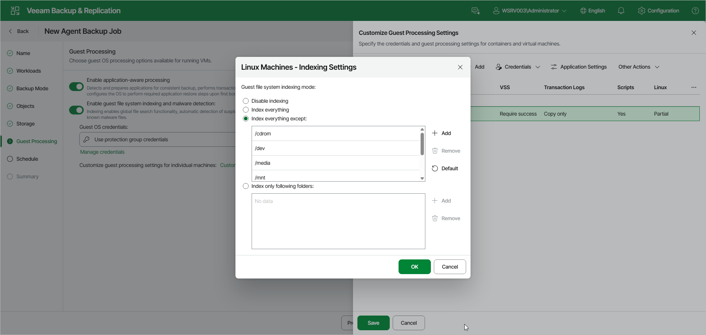

# File Indexing

You can instruct the Veeam Agent backup job managed by the backup server to create an index of files and folders on the protected computer OS during backup. If you enable the file indexing option, you will be able to search for individual files inside Veeam Agent backups and perform 1-click restore in Veeam Backup Enterprise Manager. For more information on file system indexing, see the [File System Indexing](https://helpcenter.veeam.com/docs/agentforlinux/userguide/backup_job_index.html?ver=13) section in the Veeam Agent for Linux User Guide.

The collected data can also be used for malware detection if such an option is enabled in the malware detection settings. To learn more, see [Malware Detection](agents_malware_detection.md).

|  |
| --- |
| NOTE |
| File system indexing is optional. If you do not enable this option in the backup job settings, you will still be able to perform 1-click restore from the backup created with such backup job. For more information, see the [Preparing for File Browsing and Restore](https://helpcenter.veeam.com/docs/vbr/em/em_preparing_for_flr_physical.html?ver=13) section in the Veeam Backup Enterprise Manager User Guide. |

To specify file indexing options:

1. At the Guest Processing step of the wizard, make sure that the Enable guest file system indexing and malware detection toggle is on.
2. Click Customize.
3. In the Customize Guest Processing Settings window, select the check box next to the protection group or individual computer, then from the Other Actions drop-down list, select Guest Indexing.
4. In the Indexing Settings window, under Guest file system indexing mode, specify the indexing scope:

* Select Disable indexing if you do not want to create a file index for the protected computer.
* Select Index everything if you want to index all files within the backup scope that you have specified at the [Backup Mode](agent_job_mode_linux_web.md) step of the wizard. Veeam Agent for Linux will index all files that reside:

* On the protected computer OS (for entire computer backup)
* On the volumes that you have specified for backup (for volume-level backup)
* In the directories that you have specified for backup (for file-level backup)

* [For volume-level backup only] Select Index everything except if you want to index all files on your computer OS except those defined in the list. By default, system directories /cdrom, /dev, /media, /mnt, /proc, /tmp and /lost+found are excluded from indexing. You can add or delete folders using the Add and Remove buttons on the right.

To reset the list of folders to its initial state, click Default.

* [For volume-level backup only] Select Index only following folders to define directories that you want to index. You can add or delete directories to index using the Add and Remove buttons on the right.

|  |
| --- |
| NOTE |
| You can specify a custom indexing scope only for a volume-level backup job. For a file-level backup job that processes Linux-based computers, only the Index everything option is available. |

Page updated 2026-07-16

