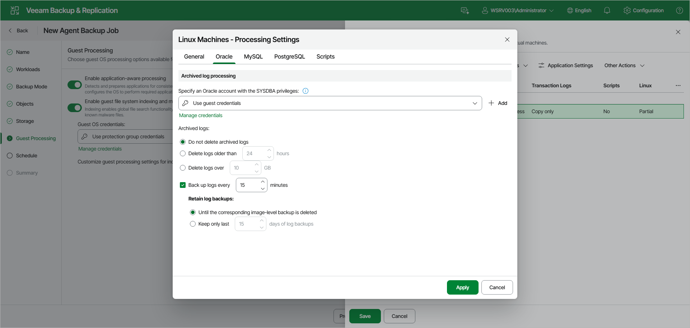

# Oracle Processing Settings

If you back up an Oracle database, you can specify how Veeam Agent for Linux must process archived logs:

1. At the Guest Processing step of the wizard, make sure that the Enable application-aware processing toggle is on.
2. Click Customize.
3. In the Customize Guest Processing Settings window, select the check box next to the protection group or individual computer and click Application Settings on the toolbar.
4. In the Processing Settings window, on the General tab, make sure that Require successful processing or Try application processing, but ignore failures is selected in the Applications section.
5. Open the Oracle tab.
6. Under Archived log processing, to specify a user account that Veeam Agent for Linux will use to connect to the Oracle database, from the Specify an Oracle account with the SYSDBA privileges drop-down list, select a database user account that has SYSDBA rights on the Oracle database.

If you have not set up credentials beforehand, click the Manage credentials link or click Add on the right to add credentials.

By default, the Use guest credentials option is selected. With this option selected, Veeam Agent for Linux will connect to the Oracle database under the account specified in the Guest OS credentials drop-down list at the Guest Processing step of the wizard.

1. In the Archived logs section, specify if Veeam Agent for Linux must delete archived logs on the Oracle database:

* Select Do not delete archived logs if you want Veeam Agent for Linux to preserve archived logs. When the backup job completes, Veeam Agent for Linux will not delete archived logs.

It is recommended that you select this option for databases for which the ARCHIVELOG mode is turned off. If the ARCHIVELOG mode is turned on, archived logs may grow large and consume all disk space. In this case, the database administrator must take care of archived logs themselves.

* Select Delete logs older than or Delete logs over if you want Veeam Agent for Linux to delete archived logs that are older than the specified number of hours or larger than the specified size in GB. Veeam Agent for Linux will wait for the backup job to complete successfully and then trigger archived logs truncation through Oracle Call Interface (OCI). If the backup job fails, the logs will remain untouched until the next successful backup job session.

|  |
| --- |
| TIP |
| If you configure backup job to back up archived logs, Veeam Agent for Linux will not trigger archived logs deletion after each log backup job session. To prevent Oracle database logs from overgrowing, run the backup job for the Veeam Agent computer more often. |

1. To back up Oracle archived logs with Veeam Agent for Linux, select the Back up logs every check box and specify the frequency for archived logs backup in minutes. By default, archived logs are backed up every 15 minutes. The minimum log backup interval is 5 minutes. The maximum log backup interval is 480 minutes.
2. In the Retain log backups section, specify retention policy for archived logs stored in the backup location:

* Select Until the corresponding image-level backup is deleted to apply the same retention policy for Veeam Agent backups and archived log backups.
* Select Keep only last to keep archived logs for a specific number of days. By default, archived logs are kept for 15 days. If you select this option, you must make sure that retention for archived logs is not greater than retention for the Veeam Agent backups. The maximum time period to keep archived logs is 60 days.

Page updated 2026-07-17

