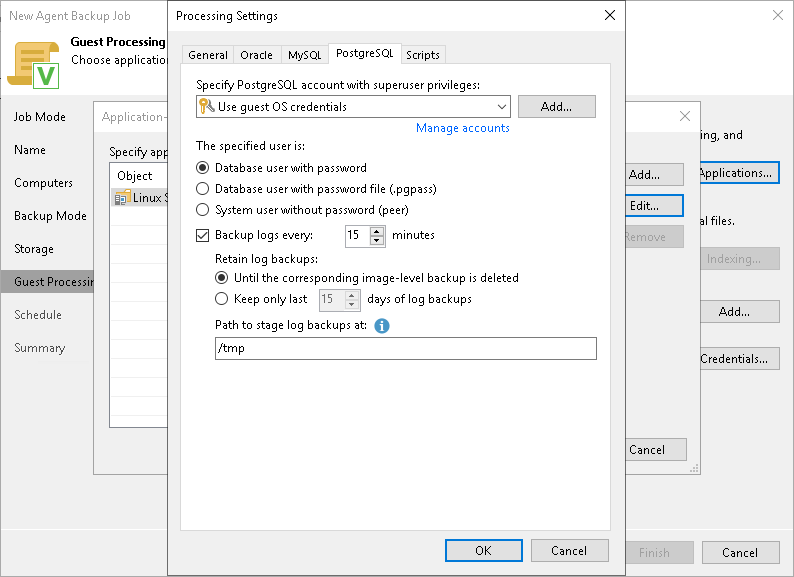

# PostgreSQL Processing Settings

In this article

You can specify how Veeam Agent for Linux must process the PostgreSQL database system.

Before You Begin

Before you configure the PostgreSQL processing, consider the following:

* Enable the following prerequisite settings:

1. At the Guest Processing step of the wizard, the Enable application-aware processing check box is selected.
2. At the Guest Processing step of the wizard, in the Application-Aware Processing Options window, a necessary protection group or individual computer is added to the list.
3. At the Guest Processing step of the wizard, in the Guest OS credentials list, a necessary user account is selected.
4. On the General tab, in the Applications section, Require successful processing or Try application processing, but ignore failures option is selected.

To learn more, see [Guest Processing Settings](agent_job_guest.md) and [Application-Aware Processing](agent_job_guest_general.md).

* Consider [Requirements and Limitations](https://helpcenter.veeam.com/docs/vbr/userguide/postgresql_backup.html?ver=13#requirements-and-limitations).

Configuring PostgreSQL Processing

|  |
| --- |
| NOTE |
| By default, Veeam Agent recursively scans the /etc/postgresql, /var/lib/postgresql and /var/lib/pgsql directories for the configuration files of PostgreSQL instances. If you keep configuration files in custom directories, the pgsqlagent agent will use its own VeeamPostgreSQLAgent.xml configuration file that is located in the /etc/veeam/ directory. The pgsqlagent agent configuration file must be a single line XML.  To explicitly include or exclude specific configuration files from rescan, you can add the following commands to the VeeamPostgreSQLAgent.xml file:   * ExcludeConfigDirs — use this element to exclude configuration files. * AddConfigDirs — use this element to include configuration files.   For example: <config AddConfigDirs="/opt/psql/" ExcludeConfigDirs="/var/lib/postgresql/13/main45/,/var/lib/postgresql/13/maindd/" /> |

To specify how Veeam Agent for Linux must process the PostgreSQL database system, perform the following:

1. At the Guest Processing step of the wizard, click Applications.
2. In the Application-Aware Processing Options window, select the necessary object, click Edit, then click the PostgreSQL tab.
3. On the PostgreSQL tab, specify a user account that Veeam Agent for Linux will use to connect to the PostgreSQL database. You can do one of the following:

* Select from the Specify PostgreSQL account with superuser privileges list a user account that has the required rights for the database.

If you have not set up credentials beforehand, click the Manage accounts link or click Add on the right to add credentials. With this option selected, Veeam Agent for Linux will connect to the PostgreSQL database under the account that you have selected in the Specify PostgreSQL account with superuser privileges list.

Keep in mind that if you plan to select the peer authentication method at the [step 4](#4) of this procedure, you can add a user account in the Credentials Manager without specifying the password for the account.

* Select the Use guest OS credentials option.

With this option selected, Veeam Agent for Linux will do the following:

1. Veeam Agent will check if you have specified custom credentials for the computer or protection group in the Guest OS Credentials window at the Guest Processing step of the wizard.

If you specify custom credentials for the computer or protection group in the Guest OS Credentials window, Veeam Agent will process the PostgreSQL database under the account that you have specified in this window.

If you do not specify custom credentials for the computer or protection group, Veeam Agent will do as described in the step ii of this procedure.

To learn more, see [step 5 in Specify Guest Processing Settings](agent_job_guest.md#5).

1. Veeam Agent will check what you have selected in the Guest OS credentials list at the Guest Processing step of the wizard.

If you specify credentials in the Guest OS credentials list, Veeam Agent will process the PostgreSQL database under the account that you specify in this list.

If you do not specify credentials in the list and select the Use protection group credentials option instead, Veeam Agent will do as described in the step iii of this procedure.

To learn more, see [step 4 in Specify Guest Processing Settings](agent_job_guest.md#4).

1. Veeam Agent will check what credentials you have specified for the computer or protection group at the Computers step of the wizard.

If you specify stored credentials for this computer in the protection group settings, Veeam Agent will process the PostgreSQL database using the specified account.

If you specify single-use credentials for this computer in the protection group settings, Veeam Agent will process the PostgreSQL database using the root user.

To learn more, see [Specifying Computers](agents_protection_group_computers.md).

1. In the The specified user is field, specify how Veeam Agent will connect to the PostgreSQL database.

The The specified user is field is connected closely with the Specify PostgreSQL account with superuser privileges list. Veeam Agent will do the following depending on what you specified using these two controls.

| Control | | Veeam Agent Behavior |
| --- | --- | --- |
| Specify PostgreSQL Account with Superuser Privileges | The Specified User Is |
| The Use guest OS credentials option is selected. | The Database user with password option is selected. | * Veeam Agent will apply the guest OS user for processing. * Veeam Agent will connect to the PostgreSQL database using the database user with the same name as the guest OS user. |
| The Database user with password file option is selected. | * Veeam Agent will apply the guest OS user for processing. * Veeam Agent will connect to the PostgreSQL database using the password file stored in the home directory of the guest OS user. |
| The System user without password option is selected. | * Veeam Agent will apply the guest OS user for processing. * Veeam Agent will use the guest OS user for peer connection to the PostgreSQL database. |
| The user account is specified. | The Database user with password option is selected. | * Veeam Agent will apply the guest OS user for processing. * Veeam Agent will connect to the PostgreSQL database using the database user specified in the Specify PostgreSQL account with superuser privileges list. |
| The Database user with password file option is selected. | * Veeam Agent will apply the guest OS user for processing. * Veeam Agent will connect to the PostgreSQL database using the password file stored in the home directory of the user specified in the Specify PostgreSQL account with superuser privileges list. |
| The System user without password option is selected. | * Veeam Agent will apply the user specified in the Specify PostgreSQL account with superuser privileges list.  * Veeam Agent will use the selected user for peer connection to the PostgreSQL database. |

1. To back up PostgreSQL archived logs with Veeam Agent, select the Backup log every <N> minutes check box and specify the frequency for archived logs backup. By default, archived logs are backed up every 15 minutes. The minimum log backup interval is 5 minutes. The maximum log backup interval is 480 minutes.
2. In the Retain log backups section, specify retention policy for archived logs stored in the backup location:

* Select Until the corresponding image-level backup is deleted to apply the same retention policy for Veeam Agent backups and archived log backups.
* Select Keep only last <N> days to keep archived logs for a specific number of days. By default, archived logs are kept for 15 days. If you select this option, you must make sure that retention for archived logs is not greater than retention for the Veeam Agent backups. The maximum time period to keep archived logs is 60 days.

1. In the Path to stage log backups at field, specify temporary storage location for the archive logs.

During backup, Veeam Agent saves archive logs to a temporary storage, move logs to a Veeam backup repository and deletes logs from a temporary storage. Keep in mind the following:

* Directory set as a temporary storage location must be locally accessible by the guest OS and have enough free space.
* If temporary storage location for the archive logs is not specified or Veeam Agent cannot save logs in the specified directory for some reason, Veeam Agent will not be able to back up logs.

For more information on how Veeam Agent for Linux processes the PostgreSQL database system, see the [PostgreSQL Backup](https://helpcenter.veeam.com/docs/agentforlinux/userguide/postgresql_backup.html?ver=13) section in the Veeam Agent for Linux User Guide.

Page updated 11/4/2025

Page content applies to build 13.0.1.1071
