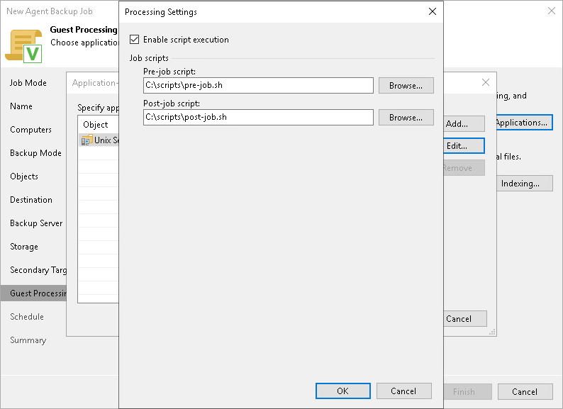

# Backup Job Scripts

In this article

You can specify custom backup job scripts that will be executed within the backup job session on Unix computers. Veeam Agent supports pre-job and post-job scripts that run on the Veeam Agent computer before and after the backup job session. To learn more about requirements for scripts, see [Backup Job Scripts](agents_backup_unix_scripts.md).

To specify custom scripts for the job:

1. At the Guest Processing step, select the Enable application-aware processing check box.
2. Click Applications.
3. In the displayed list, select a protection group or individual computer and click Edit.

To define custom settings for a computer added as a part of a protection group, you must include the computer to the list as a standalone object. To do this, click Add and choose the computer whose settings you want to customize. Then select the computer in the list and define the necessary settings.

1. In the Processing Settings window, select the Enable script execution check box.
2. In the Pre-job script and Post-job script fields, click Browse to choose executable files from a local folder on the backup server.

Veeam Agent supports scripts in the SH file format. During the backup job session, Veeam Backup & Replication will upload the scripts to the /var/lib/veeam/scripts directory on each Veeam Agent computer added to the job and execute them on these computers.

Page updated 11/17/2025

Page content applies to build 13.0.1.1071
