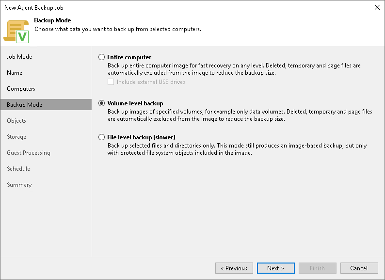

# Step 5. Select Backup Mode

In this article

At the Backup Mode step of the wizard, select the mode in which you want to create a backup.

1. In the Backup mode section, select the backup mode. You can select one of the following options:

* Entire computer — select this option if you want to create a backup of the entire computer image. When you restore data from such backup, you will be able to recover the entire computer image as well as data on specific computer volumes: files, folders, application data and so on. With this option selected, you will pass to [Storage](agent_job_target_settings.md) step of the wizard.
* Volume level backup — select this option if you want to create a backup of specific computer volumes, for example, all volumes except the system one. When you restore data from such backup, you will be able to recover data located on these volumes only: files, folders, application data and so on. With this option selected, you will pass to the [Objects](agent_job_volumes.md) step of the wizard.
* File level backup — select this option if you want to create a backup of individual folders on your computer. With this option selected, you will pass to the [Objects](agent_job_folders.md) step of the wizard.

If necessary, you can edit the backup mode settings after you create the backup job.

1. [For entire computer backup] If you want to include in the backup one or more external USB drives, select the Include external USB drives check box. With this option selected, Veeam Agent will include in the backup all external USB drives that are connected to the Veeam Agent computer at the time when the backup job starts. To learn more, see the [Backup of External Drives](https://helpcenter.veeam.com/docs/agentforwindows/userguide/backup_usb.html?ver=13) section in the Veeam Agent for Microsoft Windows User Guide.

|  |
| --- |
| NOTE |
| Consider the following:   * The File level backup option is not available if you have selected the Failover cluster option at the [Job Mode](agent_job_protection_mode.md) step of the wizard. * Veeam Agent for Microsoft Windows cannot back up hidden non-system volumes. * File-level backup is typically slower than volume-level backup. Depending on the performance capabilities of your computer and backup environment, the difference between file-level and volume-level backup job performance may increase significantly. If you plan to back up all folders with files on a specific volume or back up large amount of data, we recommend that you configure volume-level backup instead of file-level backup. |

Page updated 11/4/2025

Page content applies to build 13.0.1.1071
