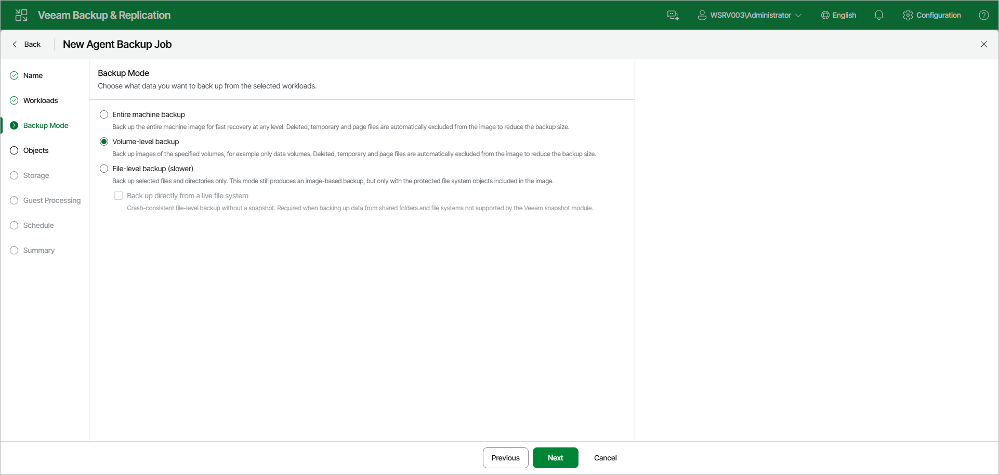

# Step 5. Select Backup Mode

At the Backup Mode step of the wizard, choose what data you want to back up from the selected workloads. You can select one of the following options:

* Entire machine backup — select this option to back up the entire machine image for fast recovery at any level. Deleted, temporary, and page files are automatically excluded from the image to reduce the backup size. With this option selected, you will pass to the [Storage](agent_job_target_set_linux_web.md) step of the wizard.
* Volume-level backup — select this option to back up images of specified volumes only, for example only data volumes. Deleted, temporary, and page files are automatically excluded from the image to reduce the backup size. With this option selected, you will pass to the [Objects](agent_job_volumes_linux_web.md) step of the wizard.
* File-level backup — select this option to back up selected files and directories only. This mode still produces an image-based backup, but only with the protected file system objects included in the image. With this option selected, you will pass to the [Objects](agent_job_folders_linux_web.md) step of the wizard.

[For file-level backup] If you want to perform backup in the snapshot-less mode, select the Back up directly from a live file system check box. Veeam Agent for Linux will not create a snapshot of a backed-up volume during backup, so the resulting backup is crash-consistent. This mode is required when you back up data from shared folders and file systems that are not supported by the Veeam snapshot module. To learn more, see the [Snapshot-Less File-Level Backup](https://helpcenter.veeam.com/docs/agentforlinux/userguide/file_backup_snapshotless.html?ver=13) section in the Veeam Agent for Linux User Guide.

If necessary, you can edit the backup mode settings after you create the backup job.

|  |
| --- |
| TIP |
| File-level backup is typically slower than volume-level backup. Depending on the performance capabilities of your computer and backup environment, the difference between file-level and volume-level backup job performance may increase significantly. If you plan to back up all folders with files on a specific volume or back up large amount of data, it is recommended that you configure volume-level backup instead of file-level backup. |

Page updated 2026-07-16

