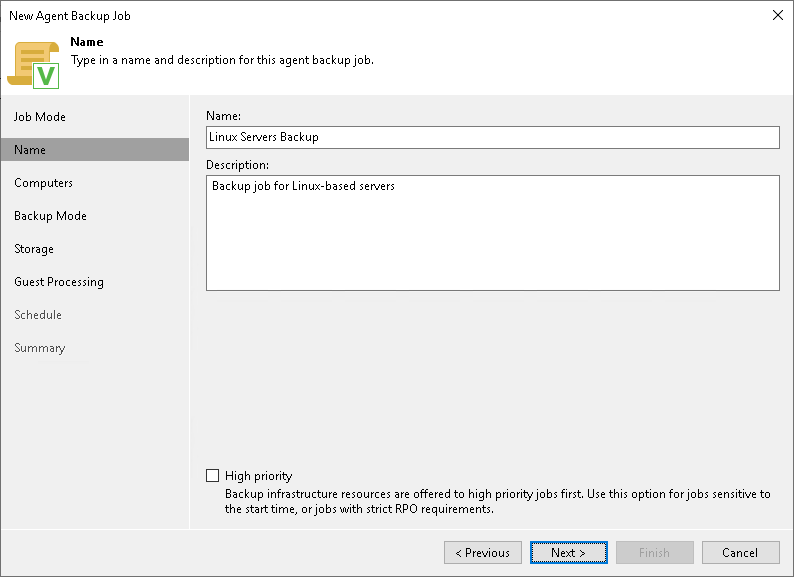

# Step 3. Specify Job Name and Description

At the Name step of the wizard, specify a name and description for the Veeam Agent backup job managed by the backup server.

1. In the Name field, enter a name for the backup job.
2. In the Description field, provide a description for future reference. The default description contains information about the user who created the job, date and time when the job was created.
3. Select the High priority check box if you want the resource scheduler of Veeam Backup & Replication to prioritize this job higher than other similar jobs and to allocate resources to it in the first place. To learn more, see [Job Priorities](job_priorities.md).

