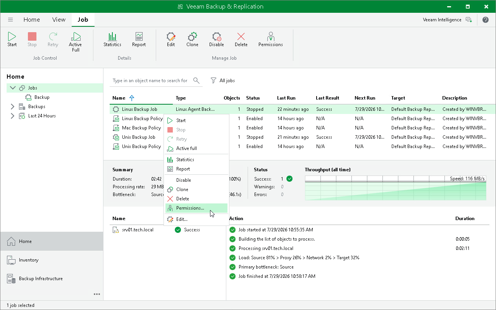
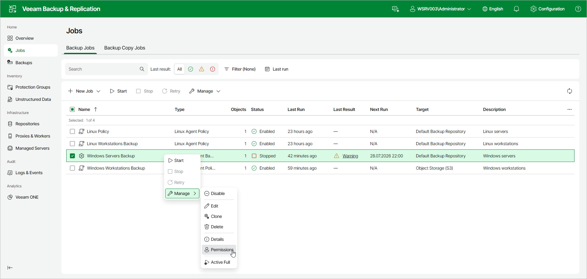

# Setting Veeam Agent Backup Job Permissions

You can view who owns a Veeam Agent backup job and who can access it. You can also change the job owner and grant or revoke access to the job on the Permissions tab.

The Job owner box shows the user account that owns the job. By default, the job is owned by the account that created it. Only the current job owner or a Veeam Backup & Replication administrator can change the job owner or modify access entries.

The Effective Access box lists the users and roles that have been granted access to the job and the level of access each one has. By default, no access is granted.

You can set Veeam Agent backup job permissions in one of the following ways:

* [Using Veeam Backup & Replication Console](#console)
* [Using Veeam Backup & Replication Web UI](#webui)

Setting Veeam Agent Backup Job Permissions Using Veeam Backup & Replication Console

To open the Permissions tab:

1. Open the Home view.
2. In the inventory pane, select Jobs.
3. In the working area, select the Veeam Agent backup job and click Permissions on the ribbon or right-click the job and select Permissions.

On the Permissions tab, you can do the following:

* To change the job owner, click Change next to the Job owner field and select the account that will own the job.
* To grant access, in the Effective Access section, click Add and select the user or group.
* To revoke access, select an entry in the list and click Remove.

Setting Veeam Agent Backup Job Permissions Using Veeam Backup & Replication Web UI

To open the Permissions tab:

1. In the management pane, click Jobs.
2. Select the check box next to the necessary backup job, and from the Manage drop-down list, select Permissions. Alternatively, right-click the job and click Manage > Permissions.

For details on how to change the job owner and grant or revoke access on the Permissions tab, see [Managing Backup Job Permissions](job_details_permissions_web.md).

Page updated 2026-07-31

