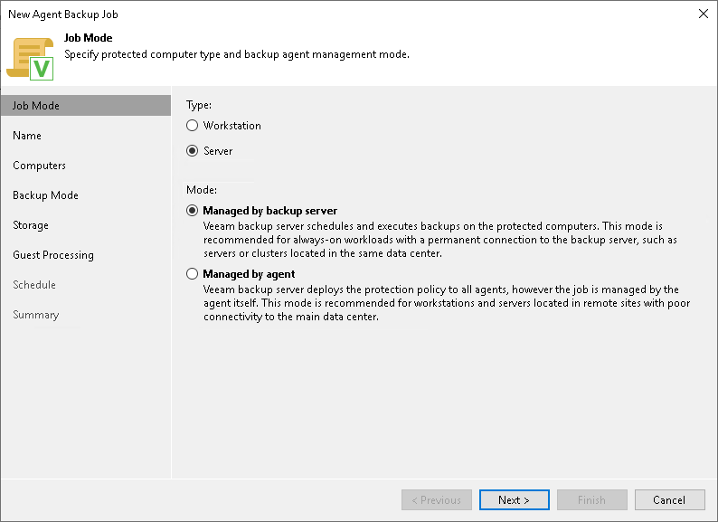

# Step 2. Select Job Mode

At the Job Mode step of the wizard, specify protection settings for the Veeam Agent backup job managed by the backup server:

1. [Select the type of protected computers whose data you want to back up with Veeam Agents](#type).
2. [If you choose to back up data on servers, select the job mode](#mode).

Selecting Protected Computer Type

To create a Veeam Agent backup job managed by the backup server, at the Job Mode step of the wizard, in the Type field, select the Server option.

|  |
| --- |
| NOTE |
| You cannot select the Workstation option if you want to create a Veeam Agent backup job managed by backup server. |

Selecting Job Mode

If you selected the Server option in the [Type](#type) field, in the Mode field, select the Managed by backup server job mode to create a Veeam Agent backup job managed by the backup server. If you select the Managed by agent job mode, you will create a [Veeam Agent backup policy](agent_policy_create_linux.md).

