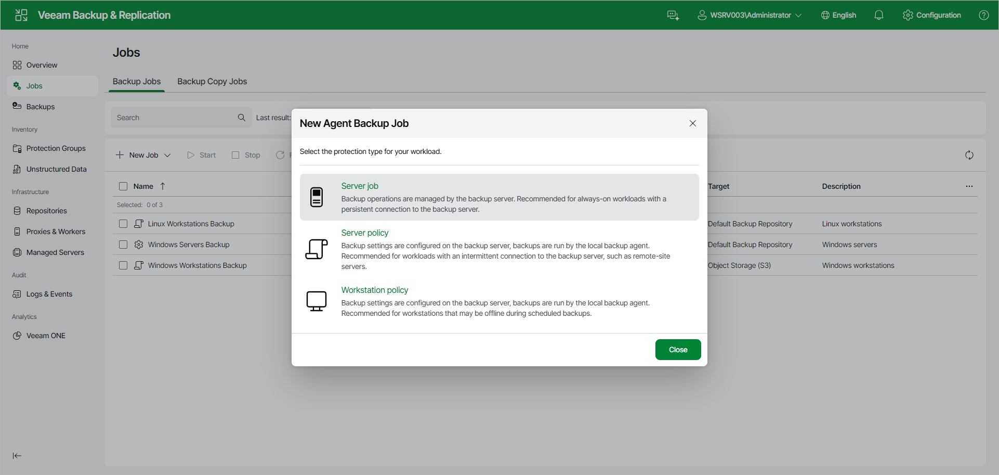

# Step 2. Select Job Mode

In the New Agent Backup Job window, select the protection type for your workload. For a Veeam Agent backup job managed by the backup server, select the following option:

* Server job — select this option to back up data on Linux-based servers. This option is recommended for computers with a persistent connection to the backup server.

For backup jobs that process servers, Veeam Backup & Replication offers settings similar to the job settings available in Veeam Agent for Linux operating in the Server mode. To learn more, see the [Veeam Agent for Linux User Guide](https://helpcenter.veeam.com/docs/agentforlinux/userguide/overview.html?ver=13).

If you want to create a Veeam Agent backup policy, select the Server policy or Workstation policy option. To learn more, see [Creating Policy for Linux Computers Using Web UI](agent_policy_create_linux_web.md).

Page updated 2026-07-16

