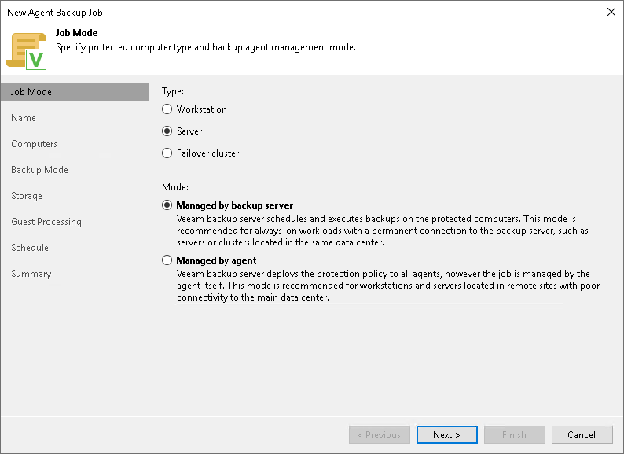

# Step 2. Select Job Mode

In this article

At the Job Mode step of the wizard, specify protection settings for the Veeam Agent backup job managed by the backup server:

1. [Select the type of protected computers whose data you want to back up with Veeam Agents](#type).
2. [If you choose to back up data on servers, select the job mode](#mode).

Selecting Protected Computer Type

At the Job Mode step of the wizard, in the Type field, select the type of protected computers whose data you want to back up with Veeam Agents. The selected type defines what modes will be available for the configured backup job and what job settings will be available at subsequent steps of the wizard. For the backup job managed by backup server, you can select one of the following computer types:

* Server — select this option if you want to back up data on standalone servers. This option is suitable for computers that have permanent connection to the backup server.

For backup jobs that process servers, Veeam Backup & Replication offers settings similar to the settings of the backup job available in the Server edition of Veeam Agent for Microsoft Windows. To learn more, see the [Veeam Agent for Microsoft Windows User Guide](https://helpcenter.veeam.com/docs/agentforwindows/userguide/overview.html?ver=13).

With this option selected, you can also select the job mode. To learn more, see [Selecting Job Mode](#mode).

* Failover cluster — select this option if you want to back up data on a failover cluster.

For backup jobs that process failover clusters, Veeam Backup & Replication offers practically the same backup job settings as for servers.

With this option selected, the backup job will be managed by the Veeam backup server — you do not need to select the job mode.

|  |
| --- |
| NOTE |
| You cannot select the Workstation option if you want to create a backup job managed by backup server. |

Selecting Job Mode

If you selected the Server computer type in the Type field, in the Mode field, select the Managed by backup server job mode. If you select the Managed by agent job mode, you will create a [Veeam Agent backup policy](agent_policy_create_win.md).

If you selected the Failover cluster computer type in the Type field, you do not need to select the job mode in the Mode field, the Managed by backup server job mode will be selected automatically.

If you want to create a Veeam Agent backup policy, see [Creating Policy for Windows Computers](agent_policy_create_win.md).

Page updated 11/4/2025

Page content applies to build 13.0.1.1071
