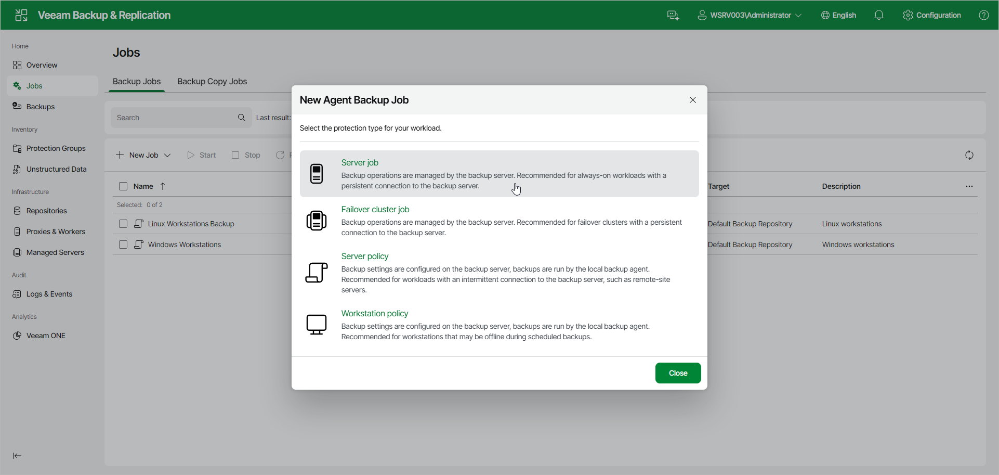

# Step 2. Select Job Mode

In the New Agent Backup Job window, select the type of the backup job. For a Veeam Agent backup job managed by the backup server, select one of the following options:

* Server job — select this option to back up data on standalone servers. This option is recommended for computers with a persistent connection to the backup server.

For backup jobs that process servers, Veeam Backup & Replication offers settings similar to the settings of the backup job available in the Server edition of Veeam Agent for Microsoft Windows. To learn more, see the [Veeam Agent for Microsoft Windows User Guide](https://helpcenter.veeam.com/docs/agentforwindows/userguide/overview.html?ver=13).

* Failover cluster job — select this option to back up data on a failover cluster. This option is recommended for failover clusters with a persistent connection to the backup server.

For backup jobs that process failover clusters, Veeam Backup & Replication offers practically the same backup job settings as for servers.

If you want to create a Veeam Agent backup policy, select the Server policy or Workstation policy option. To learn more, see [Creating Policy for Windows Computers Using Web UI](agent_policy_create_win_web.md).

Page updated 2026-07-14

