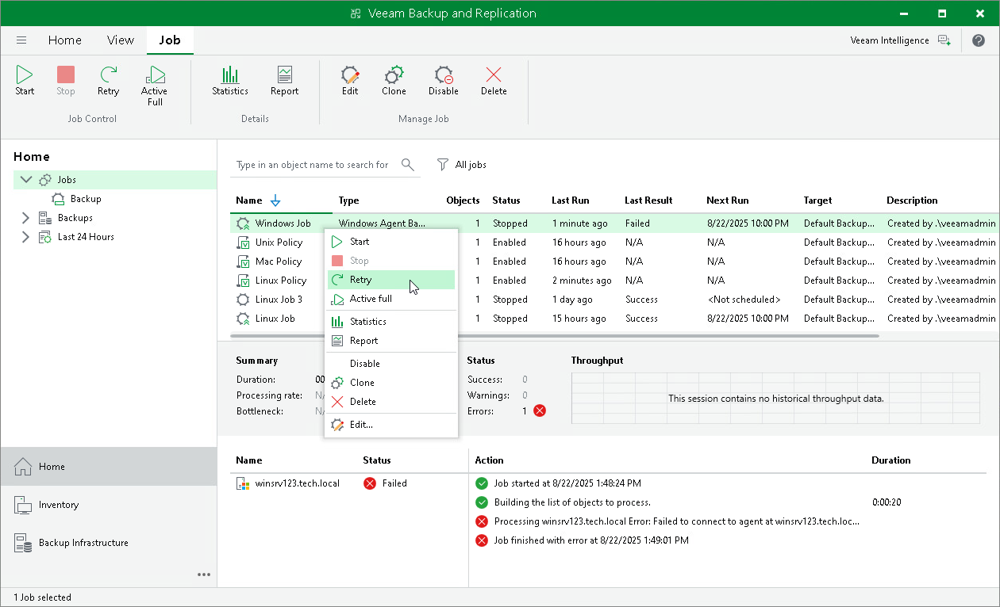
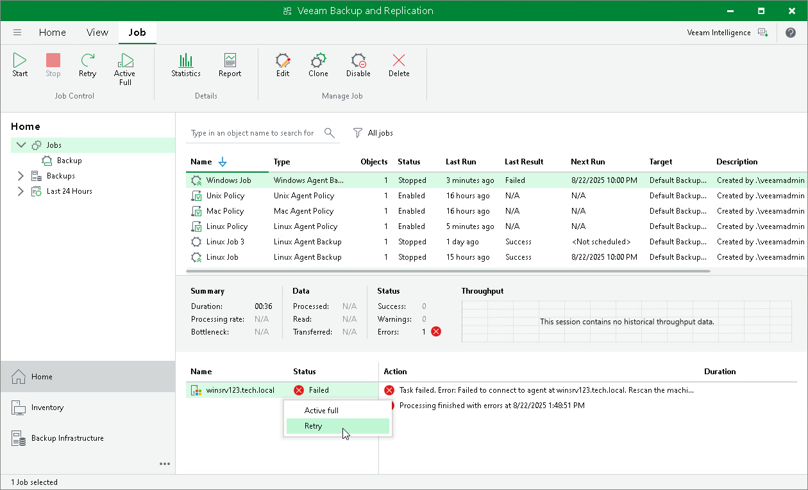

# Retrying Veeam Agent Backup Job

You can manually retry a Veeam Agent backup job configured in Veeam Backup & Replication if the job failed during the previous job session. When you retry a Veeam Agent backup job, Veeam Backup & Replication processes only those computers in the job that were not processed successfully during the previous job session.

To retry a job:

1. Open the Home view.
2. In the inventory pane, select Jobs.
3. In the working area, select the Veeam Agent backup job and click Retry on the ribbon or right-click the job and select Retry.

|  |
| --- |
| TIP |
| You can also retry a backup job for an individual computer added to this job. To learn more, see [Retrying Job for Individual Computer](#individ). |

Retrying Job for Individual Computer

To retry a backup job for an individual computer:

1. Open the Home view.
2. In the inventory pane, select Jobs.
3. In the working area, select the Veeam Agent backup job.
4. In the bottom part of Veeam Backup & Replication, find the list of computers that are processed by the selected backup job. In the list, right-click the computer with the Failed status and click Retry.

Keep in mind that you will be able to launch retry for another computer in the same job only after retry finishes for the selected computer.

