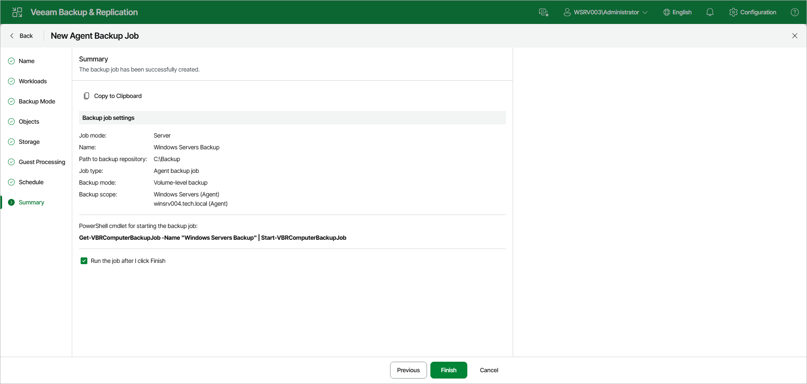

# Step 11. Review Backup Job Settings

At the Summary step of the wizard, complete the backup job configuration process.

1. Review the settings of the configured Veeam Agent backup job in the Backup job settings section. To copy the settings to the clipboard, click Copy to Clipboard.
2. Select the Run the job after I click Finish check box if you want to start the job right after you finish working with the wizard.
3. Click Finish to close the wizard.

|  |
| --- |
| TIP |
| You can use the [Get-VBRComputerBackupJob](https://helpcenter.veeam.com/docs/vbr/powershell/get-vbrcomputerbackupjob.html?ver=13) and [Start-VBRComputerBackupJob](https://helpcenter.veeam.com/docs/vbr/powershell/start-vbrcomputerbackupjob.html?ver=13) cmdlets to manage the backup job from the PowerShell command line. The cmdlet with the current job's name is also displayed under PowerShell cmdlet for starting the backup job. |

Page updated 2026-07-15

