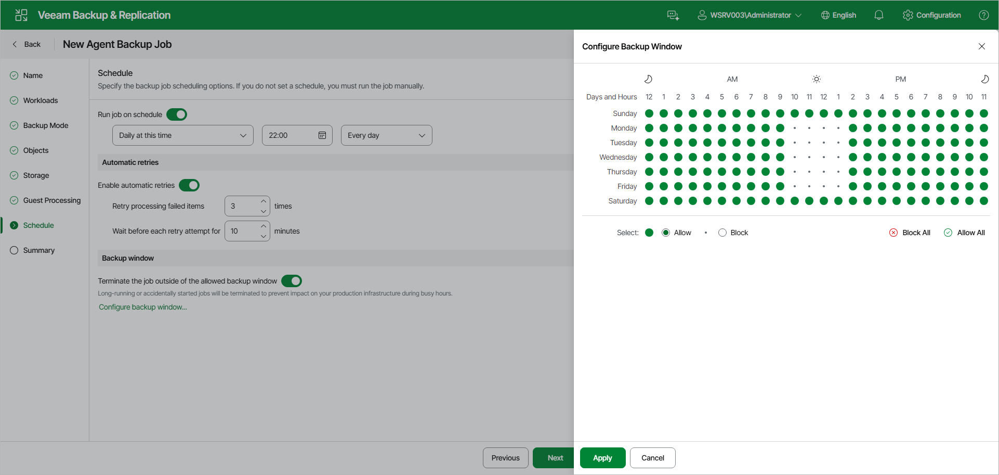

# Step 10. Specify Backup Schedule

At the Schedule step of the wizard, specify the backup job scheduling options. If you do not set a schedule, you must run the job manually.

To specify the job schedule:

1. Turn on the Run job on schedule toggle. If the toggle is off, you will have to start the backup job manually to create backup.
2. Define scheduling settings for the job:

|  |
| --- |
| NOTE |
| The backup job runs according to the local time of the Veeam backup server. |

* To run the job at a specific time daily, on defined week days or with specific periodicity, select Daily at this time from the drop-down list. Use the fields on the right to configure the necessary schedule.
* To run the job once a month on specific days, select Monthly at this time. Use the fields on the right to configure the necessary schedule.
* To run the job repeatedly throughout a day with a specific time interval, select Periodically every. In the field on the right, select the necessary time unit: Hours or Minutes. Click Schedule and use the time table to define the permitted time window for the job. In the Start time within an hour field, specify the exact time when the job must start.

A repeatedly run job is started by the following rules:

* The defined interval always starts at 12:00 AM. For example, if you configure to run a job with a 4-hour interval, the job will start at 12:00 AM, 4:00 AM, 8:00 AM, 12:00 PM, 4:00 PM and so on.
* If you define permitted hours for the job, after the denied interval is over, the job will start immediately and then run by the defined schedule.

For example, you have configured a job to run with a 2-hour interval and defined permitted hours from 9:00 AM to 5:00 PM. According to the rules above, the job will first run at 9:00 AM, when the denied period is over. After that, the job will run at 10:00 AM, 12:00 PM, 2:00 PM and 4:00 PM.

* To run the job continuously, select the Periodically every option and choose Continuously from the list on the right. A new backup job session will start as soon as the previous backup job session finishes.
* To chain jobs, use the After this job field. In the common practice, jobs start one after another: when job A finishes, job B starts and so on. If you want to create a chain of jobs, you must define the time schedule for the first job in the chain. For the rest of the jobs in the chain, select the After this job option and choose the preceding job from the list.

|  |
| --- |
|  NOTE |
| The After this job function will automatically start a job if the first job in the chain is started automatically by schedule. If you start the first job manually, Veeam Backup & Replication will display a notification. You will be able to choose whether Veeam Backup & Replication must start the chained job as well. |

1. In the Automatic retries section, turn on the Enable automatic retries toggle if you want Veeam Backup & Replication to attempt to run the backup job again if the job fails for some reason. In the Retry processing failed items field, specify the number of attempts to run the job. In the Wait before each retry attempt for field, specify the time interval between attempts in minutes. If you select continuous backup, Veeam Backup & Replication retries the job for the defined number of times without any time intervals between the job runs.

|  |
| --- |
| NOTE |
| The automatic retry does not start if you run the backup job manually. In this case, you can manually retry the backup job. To learn more, see [Retrying Veeam Agent Backup Job](agent_job_retry.md). |

1. In the Backup window section, define the time interval within which the backup job is allowed to run. The backup window prevents the job from overlapping with production hours and ensures that the job does not impact performance of your server. To set up a backup window for the job:

1. Turn on the Terminate the job outside of the allowed backup window toggle and click Configure backup window.
2. In the Configure Backup Window window, use the time table to define the allowed and blocked hours for the backup job:

* The green area indicates the allowed backup window — the hours when the backup job is allowed to run.
* The white area indicates the blocked window — the hours when the backup job is not allowed to run. If the Terminate the job outside of the allowed backup window toggle is on, a job that is still running when the blocked window starts is automatically terminated.
* To change the state of individual cells, next to Select, select Allow or Block, and then click or drag over the cells in the time table. To apply the same state to all cells, click Allow All or Block All.

If the job exceeds the allowed window, it will be automatically terminated. In this case, data transport and backup chain transformation processes are stopped. Keep in mind that this behavior differs from a VM backup job where backup window affects data transport process and health check operations only.

Page updated 2026-07-15

