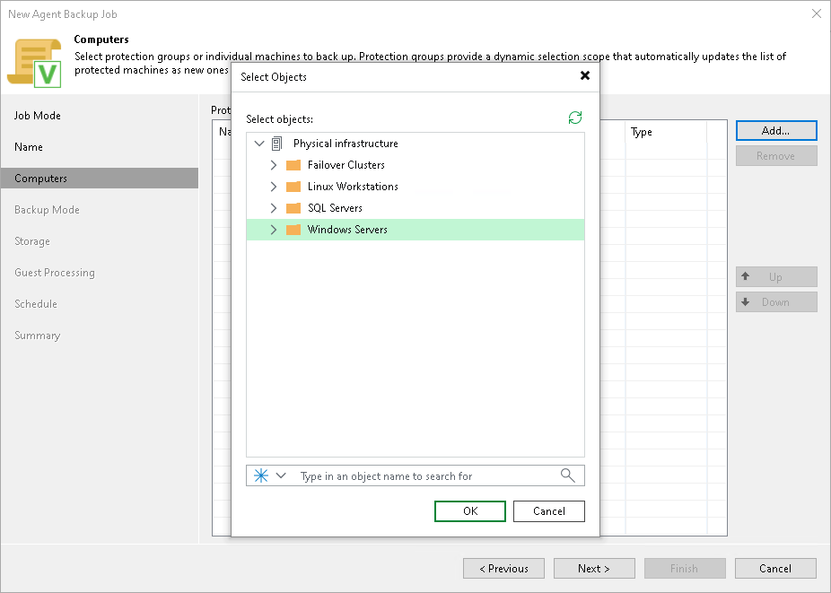
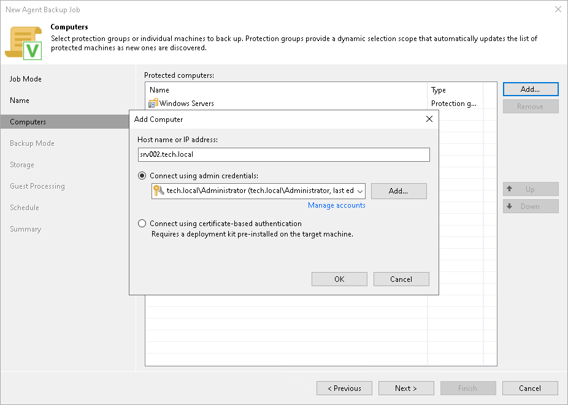

# Step 4. Select Computers to Back Up

At the Computers step of the wizard, select protection groups and individual computers whose data you want to back up with the Veeam Agent backup job managed by the backup server.

You can add to the Veeam Agent backup job managed by the backup server one or more protection groups and individual computers from the Veeam Backup & Replication inventory. You can also add to the job computers that are not added to inventory yet. Veeam Backup & Replication will add such computers to the job and also add them to the Manually Added protection group.

If Veeam Backup & Replication discovers a new computer in a protection group after the Veeam Agent backup job is created, Veeam Backup & Replication will automatically update the job settings to include the added computer.

|  |
| --- |
| NOTE |
| Consider the following:   * Veeam Backup & Replication displays protection groups for pre-installed Veeam Agents and their members only if you selected the Managed by agent option at the Job Mode step of the wizard. You cannot add protection groups for pre-installed Veeam Agents to backup jobs managed by backup server. To learn more, see [Protection Group Types](agents_protection_groups_types.md). * If you used the Add to backup job > Windows > New job option to launch the New Agent Backup Job wizard, the Protected computers list will already contain computers that you have selected to add to the job. You can remove some computers from the job or add new computers to the job, if necessary. |

Adding Protection Groups and Computers from Inventory

To add protection groups and individual computers to the Veeam Agent backup job, do the following:

1. Click Add > Protection group.
2. In the Select Objects window, select one or more protection groups and computers in the list and click OK. You can press and hold the [Ctrl] or [Shift] key to select multiple objects at once.

To quickly find the necessary object, use the search field at the bottom of the Select Objects window.

1. Enter the object name or a part of it in the search field.
2. Click the Start search button on the right or press [Enter].

Adding New Computers

To add to the Veeam Agent backup job new computers that do not exist in the inventory, do the following:

1. Click Add > Individual computer.
2. In the Add Computer window, in the Host name or IP address field, enter a full DNS name, hostname or IP address of the computer that you want to add to the job.
3. Select a method to connect to the computer:

* Connect using admin credentials. In this case, select a user account that has administrative permissions on the computer that you want to add to the job. If you have not set up credentials beforehand, click the Manage accounts link or click Add on the right to add credentials.

* Connect using certificate-based authentication. Select this option, if you chose to pre-install Veeam Installer Service on the computer that you want to add to the backup job. In this case, Veeam Backup & Replication will communicate with the computer using a certificate. To learn more, see [Deploying Veeam Agent Using Veeam Deployment Kit](agents_deploy_deployer.md).

After you complete the backup job configuration, the added computers will appear in the Manually Added protection group. To learn more, see [Predefined Protection Groups](agents_protection_groups_default.md).

