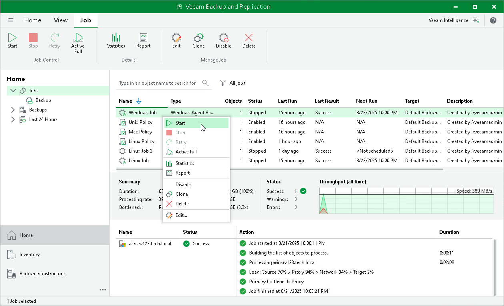
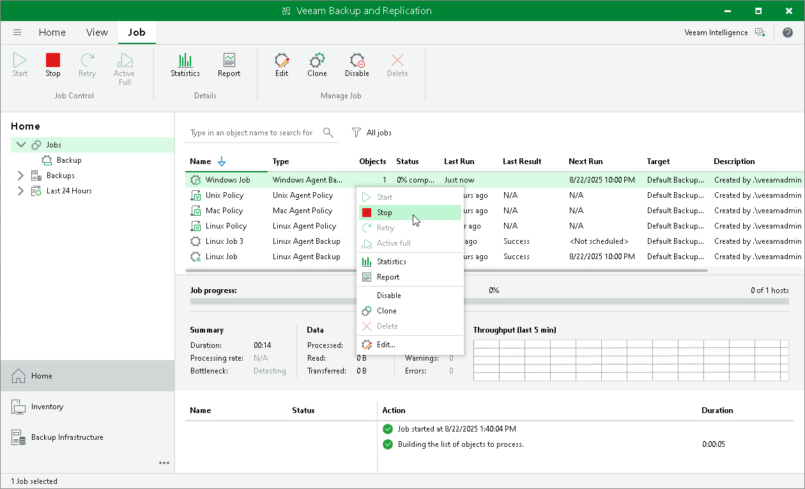

# Starting and Stopping Veeam Agent Backup Job

You can start a Veeam Agent backup job manually, for example, if you want to create an additional restore point in the backup chain and do not want to change the job schedule. You can also stop a job, for example, if processing of a Veeam Agent computer is about to take long, and you do not want the job to produce load on the production environment during business hours.

Starting Jobs

To start a job:

1. Open the Home view.
2. In the inventory pane, select Jobs.
3. In the working area, select the Veeam Agent backup job and click Start on the ribbon or right-click the job and select Start.

Stopping Jobs

You can stop a Veeam Agent backup job in one of the following ways:

* Stop job immediately. In this case, Veeam Backup & Replication will produce a new restore point only for those computers in the job that have already been processed by the time you stop the job.
* Stop job gracefully. In this case, Veeam Backup & Replication will produce a new restore point only for those computers in the job that have already been processed and for computers that are being processed at the moment.

To stop a job immediately:

1. Open the Home view.
2. In the inventory pane, select Jobs.
3. In the working area, select the Veeam Agent backup job and click Stop on the ribbon or right-click the job and select Stop. In the displayed window, click Immediately.

To stop a job gracefully:

1. Open the Home view.
2. In the inventory pane, click Jobs.
3. In the working area, right-click the job and select Stop. In the displayed window, click Gracefully.

