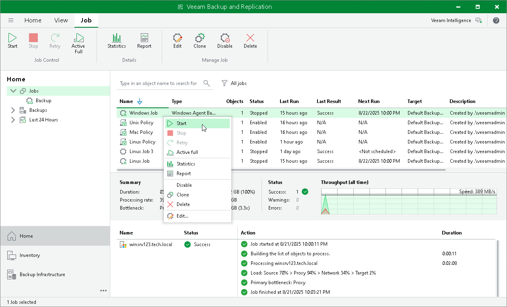
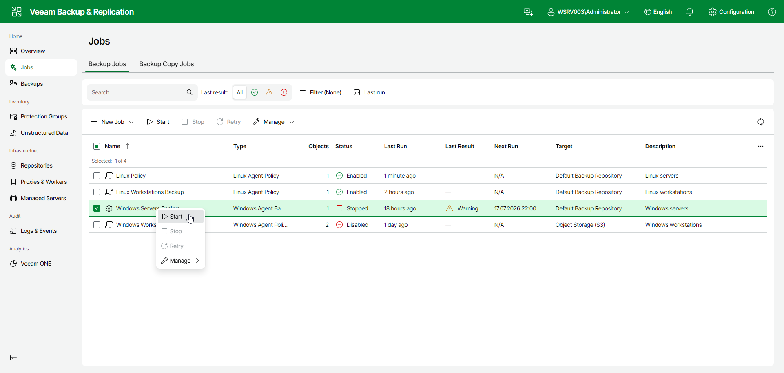

# Starting and Stopping Veeam Agent Backup Job

You can start a Veeam Agent backup job manually, for example, if you want to create an additional restore point in the backup chain and do not want to change the job schedule. You can also stop a job, for example, if processing of a Veeam Agent computer is about to take long, and you do not want the job to produce load on the production environment during business hours.

You can stop a Veeam Agent backup job in one of the following ways:

* Stop the job immediately. In this case, Veeam Backup & Replication will produce a new restore point only for those computers in the job that have already been processed by the time you stop the job.
* Stop the job gracefully. In this case, Veeam Backup & Replication will produce a new restore point only for those computers in the job that have already been processed and for computers that are being processed at the moment.

You can start or stop a Veeam Agent backup job in one of the following ways:

* [Using Veeam Backup & Replication Console](#console)
* [Using Veeam Backup & Replication Web UI](#webui)

Starting and Stopping Veeam Agent Backup Job Using Veeam Backup & Replication Console

To start or stop a Veeam Agent backup job:

1. Open the Home view.
2. In the inventory pane, select Jobs.
3. In the working area, select the Veeam Agent backup job and do one of the following:

* To start the job, click Start on the ribbon or right-click the job and select Start.
* To stop the job immediately, click Stop on the ribbon or right-click the job and select Stop. In the displayed window, click Immediately.
* To stop the job gracefully, right-click the job and select Stop. In the displayed window, click Gracefully.

Starting and Stopping Veeam Agent Backup Job Using Veeam Backup & Replication Web UI

To start or stop a Veeam Agent backup job:

1. In the management pane, click Jobs.
2. Select the check box next to the necessary backup job and do one of the following:

* To start the job, click Start on the toolbar or right-click the job and select Start.
* To stop the job, click Stop on the toolbar or right-click the job and select Stop. In the Stop Job window, click Yes.

Page updated 2026-07-28

