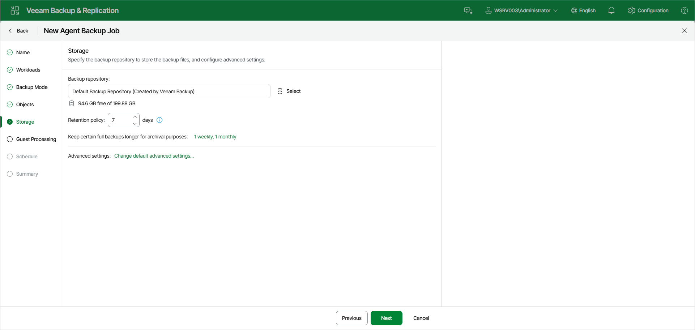

# Step 7. Specify Backup Storage Settings

At the Storage step of the wizard, specify the backup repository to store the backup files, and configure advanced settings:

1. In the Backup repository field, click Select and choose a backup repository where you want to store created backups. When you select a backup repository, Veeam Backup & Replication automatically checks and displays the amount of free space available on the backup repository.
2. In the Retention policy field, specify the number of days for which you want to store backup files in the target location. After this period is over, Veeam Backup & Replication will remove from the backup chain any restore points that are older than the specified retention period. By default, Veeam Backup & Replication keeps backup files for 7 days. To learn more, see [Short-Term Retention Policy](agents_retention.md).
3. To use the GFS (Grandfather-Father-Son) retention scheme, next to Keep certain full backups longer for archival purposes, click the current setting summary. In the Configure GFS window, specify how weekly, monthly and yearly full backups must be retained. To learn more, see [Long-Term Retention Policy (GFS)](gfs_retention_policy.md).

Keep in mind that to use the GFS retention policy, you must set Veeam Backup & Replication to create full backups. To learn more, see [Backup Settings](agent_advanced_backup_linux_web.md).

1. Click Change default advanced settings to specify advanced settings for the backup job. To learn more, see [Specify Advanced Backup Settings](agent_job_advanced_linux_web.md).

|  |
| --- |
| NOTE |
| You must enable backup file encryption in the [backup job storage settings](agent_advanced_storage_linux_web.md) if you back up data to the Veeam Data Cloud Vault storage added as a Veeam backup repository. |

Page updated 2026-07-16

